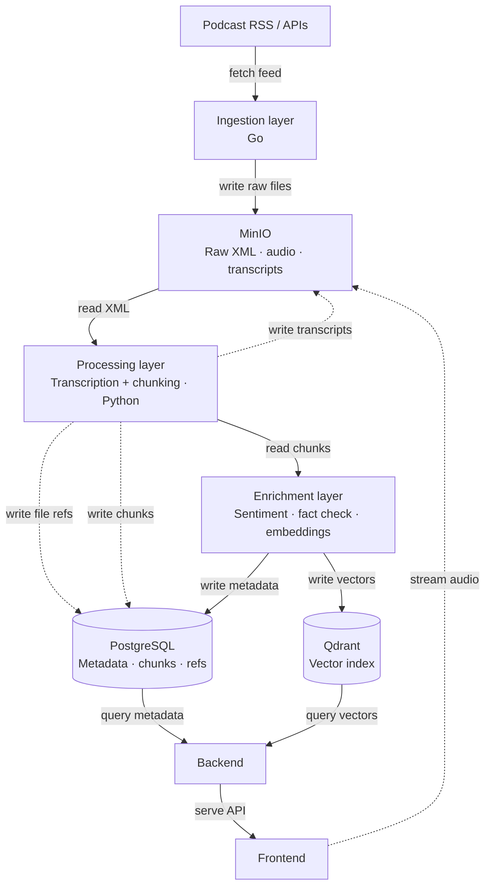

# media-lens

[Meilenstein-Plan](https://www.notion.so/33d621dfadf7805caef5e1b62101ce35?v=33d621dfadf780b3bac6000cba9df55f&pvs=32)

## Current Build (Mock / Proof of Concept)

This is an early-stage mock demonstrating the core data pipeline infrastructure.
No real analysis models are integrated yet — sentiment and topic analysis return
placeholder values.

### Architecture

```
Ingestion (Go) → MinIO (bronze bucket) → Processing (Python) → PostgreSQL
```

### Services

| Service             | Technology                                                                 | Port                       |
| ------------------- | -------------------------------------------------------------------------- | -------------------------- |
| Data Lake           | MinIO                                                                      | 9000 (API), 9001 (Console) |
| Database            | PostgreSQL 16                                                              | 5432                       |
| DB Admin UI         | pgAdmin 4                                                                  | 5050                       |
| Ingestion           | Go                                                                         | -                          |
| Silver Processing   | Python                                                                     | -                          |
| Enriched Processing | Python, LLMs(gemma3:4b, qwen3-embedding:4b), model(wav2vec-base-superb-er) | -                          |
| Backend             | -                                                                          | -                          |
| Frontend            | -                                                                          | -                          |
| Orchestration       | Airflow/Perfect                                                            | -                          |

### Pipeline

**Step 1 — Ingestion (Go)**
Fetches the RSS feed for The Daily (NYT) over HTTP and streams it directly
into the MinIO bronze bucket as `test/sample_podcast.xml`. Creates the bucket
if it does not already exist.

**Step 2 — Silver Processing (Python)**
Reads `test/sample_podcast.xml` from the bronze bucket, parses it for
`<section>` elements and splits it into sections. For each section, stub
functions return placeholder sentiment (`neutral`, `0.5`) and topics
(`unknown`). The episode and all sections are written to PostgreSQL.

**Step 3 — Enriched Silver Processing **
...

### What is not implemented yet

- Real XML section parsing (depends on final feed structure)
- Sentiment analysis model
- Topic analysis model
- Backend module
- Frontend module
- Scheduling/Orchestration
  - e.g. Airflow, Prefect, etc.

- Ingestion
  - Idempotency - guid tag
  - MinIO event notifications → processing trigger

- Config module
  - check for env variables, etc. (e.g. pydantic-settings)
- PostgreSQL - full-text-search - status column (pending, failed, enriched, ...)
- Logging
  BONUS:
- metrics and dashboard (e.g. Prometheus + Grafana)
-

### Getting Started

1. Copy the environment template and fill in your values:

```bash
cp .env.example .env
```

2. Start all services:

```bash
docker compose up
```

3. Browse MinIO at `http://localhost:9001`
4. Browse pgAdmin at `http://localhost:5050` (login: `admin@admin.com` / `admin`)

# Branching Strategy mit rebase:

- feature/{name}
- hotfix/{name}
- release
- main

# Architecture



## Semantic Search

```
User Query → Backend → Ollama (embedding) → Qdrant (search) → Response
```

- Query wird via Ollama (`qwen3-embedding:4b`) in einen 384-dim Vektor umgewandelt
- Qdrant-Payload speichert `episode_id`, `episode_title`, `podcast_name`, `text`, `start_time`
- Kein PostgreSQL-Call nötig — alle Metadaten liegen im Qdrant-Payload
- `cover_url` wird per MinIO Presigned-URL im Backend erzeugt
- Suche erfolgt zweistufig: erst Episode-Level-Matches, dann Chunk-Highlights pro Episode
- Endpoint: `GET /api/v1/search?q=...&limit=10&highlights=3&min_score=0.3`
