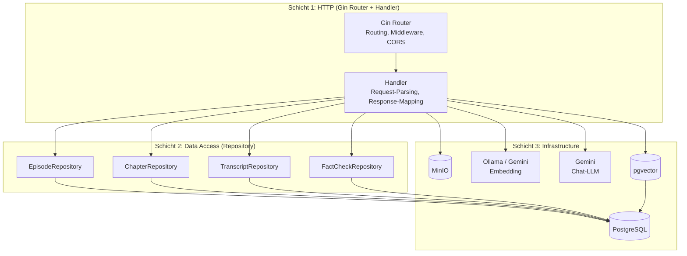
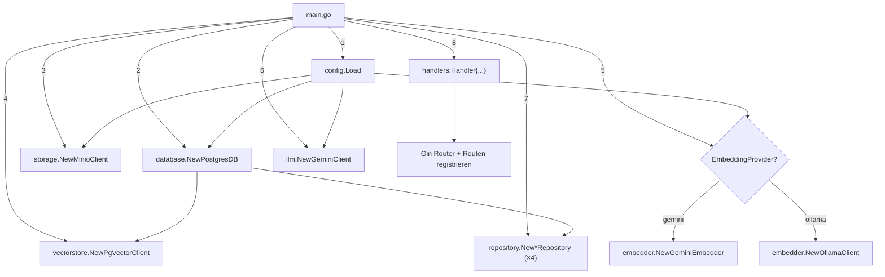
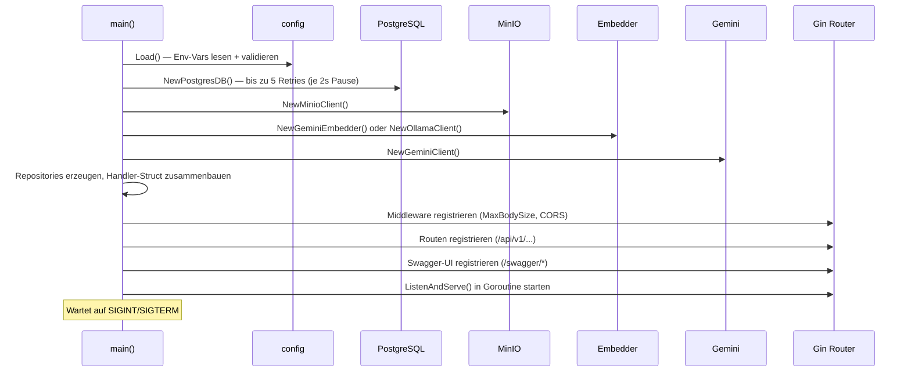
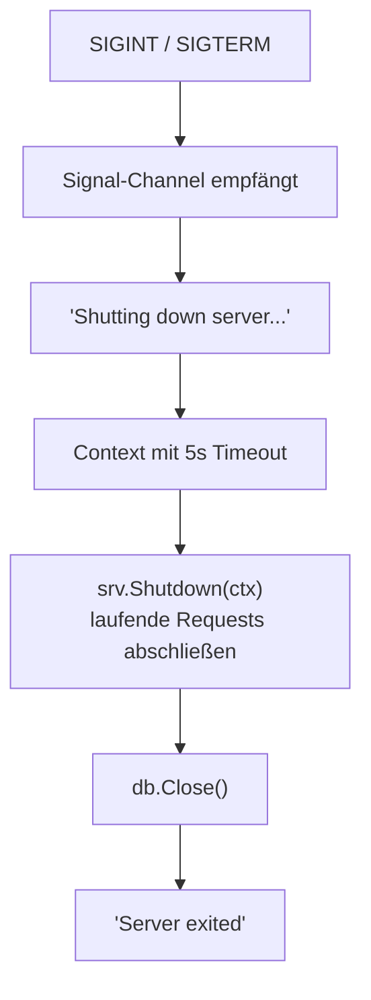
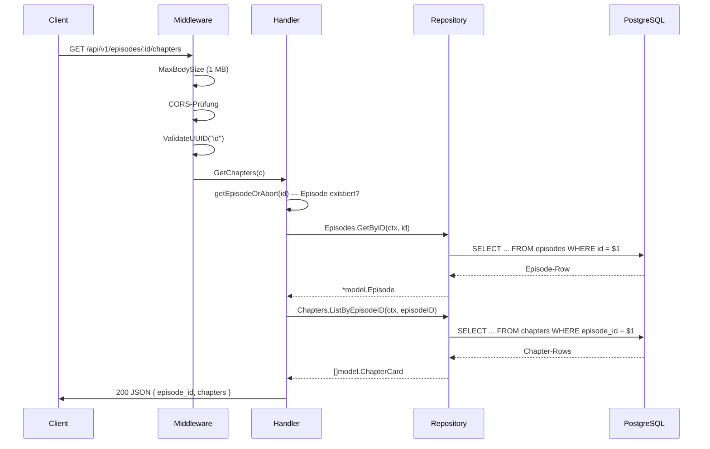
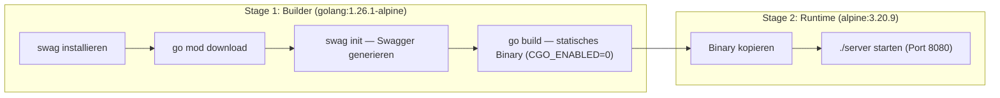

# Architektur & Projektstruktur

## Ordnerstruktur

```text
src/backend/
├── cmd/server/
│   └── main.go                        # Einstiegspunkt: Config, DI-Wiring, Routing, Graceful Shutdown
├── internal/
│   ├── api/handlers/                  # HTTP-Handler (eine Datei pro Domäne)
│   │   ├── podcasts.go                # Handler-Struct, Middleware, Episode-Liste + Detail
│   │   ├── chapters.go                # Kapitel einer Episode
│   │   ├── transcript.go              # Transkript-Zeilen einer Episode
│   │   ├── factchecks.go              # Fact-Check-Claims einer Episode
│   │   ├── chat.go                    # LLM-Chat über Episoden-Transkript
│   │   ├── search.go                  # Semantische Suche (Vektor-Ähnlichkeit)
│   │   ├── audio.go                   # Audio-Streaming (Proxy zu MinIO, Range-Requests)
│   │   ├── sync.go                    # SSE-Stream für Playback-Synchronisation
│   │   └── health.go                  # Health-Check (DB, MinIO, Embedding)
│   ├── config/
│   │   └── config.go                  # Lädt Konfiguration aus Umgebungsvariablen
│   ├── database/
│   │   └── postgres.go                # PostgreSQL-Verbindung + Connection-Pool
│   ├── model/
│   │   └── models.go                  # Alle Datenmodelle (DB-Entities + API-Response-Schemas)
│   ├── repository/
│   │   └── repository.go             # Data-Access-Layer (Interfaces + PostgreSQL-Implementierung)
│   ├── storage/
│   │   └── minio.go                   # MinIO-Client + Presigned-URL-Generierung
│   ├── embedder/
│   │   ├── embedder.go                # Embedder-Interface (Provider-Abstraktion)
│   │   ├── ollama.go                  # Ollama-Implementierung (HTTP, lokales Modell)
│   │   └── gemini.go                  # Gemini-Implementierung (Google GenAI API)
│   ├── llm/
│   │   └── gemini.go                  # LLM-Client für Chat (Gemini, mit System-Prompt + History)
│   └── vectorstore/
│       └── pgvector.go                # pgvector-Abfragen (Episoden- + Chunk-Suche)
├── docs/                              # Generierte Swagger-Dateien (swag init)
│   ├── docs.go
│   ├── swagger.json
│   └── swagger.yaml
├── Dockerfile                         # Multi-Stage Build (builder + alpine)
├── Makefile                           # swag, build, run
├── go.mod
└── go.sum
```

## Schichten-Architektur

Das Backend folgt einem klassischen **3-Schichten-Modell**, ergänzt um externe Service-Adapter:



1. **HTTP-Schicht** (`api/handlers/`): Nimmt Requests entgegen, validiert Parameter (UUID, Query,
   Body), ruft Repositories und Services auf, formatiert die Antwort als JSON und gibt den
   passenden HTTP-Status zurück. Hier sitzt auch die Middleware (CORS, MaxBodySize, UUID-Validierung).

2. **Data-Access-Schicht** (`repository/`): Definiert Interfaces (`EpisodeRepository`,
   `ChapterRepository`, ...) und implementiert sie mit `database/sql`-Queries gegen PostgreSQL.
   Jedes Repository kennt nur sein eigenes Datenmodell und die zugehörigen SQL-Statements.

3. **Infrastructure-Schicht** (`database/`, `storage/`, `embedder/`, `llm/`, `vectorstore/`):
   Verwaltet Verbindungen zu externen Systemen. Jeder Adapter ist ein eigenständiges Package mit
   einer klaren Schnittstelle (Interface oder Struct-Methoden).

## Dependency Injection (DI-Wiring)

Es gibt **keinen DI-Container**. Alle Abhängigkeiten werden in `main.go` manuell erzeugt und
in das zentrale `Handler`-Struct injiziert:



Das `Handler`-Struct bündelt alle Abhängigkeiten:

| Feld          | Typ                           | Zweck                                       |
| ------------- | ----------------------------- | ------------------------------------------- |
| `Episodes`    | `repository.EpisodeRepository`  | Episoden laden (Liste, Detail)              |
| `Chapters`    | `repository.ChapterRepository`  | Kapitel einer Episode laden                 |
| `Transcripts` | `repository.TranscriptRepository` | Transkript-Zeilen laden                   |
| `FactChecks`  | `repository.FactCheckRepository` | Fact-Check-Claims laden                   |
| `LLM`         | `*llm.GeminiClient`            | Chat-Anfragen an Gemini                     |
| `Minio`       | `*minio.Client`                 | Audio-Streaming, Cover-URLs                 |
| `Config`      | `*config.Config`                | Konfigurationswerte (Bucket, CORS, ...)     |
| `DB`          | `*sql.DB`                       | Direkt für Health-Check (`db.Ping()`)       |
| `Embedder`    | `embedder.Embedder`             | Suchanfragen in Vektoren umwandeln          |
| `VectorStore` | `*vectorstore.PgVectorClient`   | Vektor-Ähnlichkeitssuche in pgvector        |

## Startup-Ablauf



### Fehlerbehandlung beim Start

- **Config:** Fehlt eine Pflicht-Variable (`POSTGRES_URL`, `MINIO_USER`, `MINIO_PASS`,
  `GEMINI_API_KEY`), bricht der Prozess sofort mit `log.Fatalf` ab.
- **Datenbank:** Bis zu 5 Verbindungsversuche mit jeweils 2 Sekunden Pause. Schlägt auch der
  fünfte fehl, wird der Prozess beendet. Das ist relevant beim Docker-Start, wenn PostgreSQL
  noch hochfährt.
- **MinIO / Embedder / LLM:** Jeweils ein einzelner Verbindungsversuch. Bei Fehler sofortiger
  Abbruch.

## Graceful Shutdown



- `SIGINT` (Strg+C) und `SIGTERM` (`docker stop`, `kill`) werden über einen Channel abgefangen.
- `srv.Shutdown(ctx)` beendet den Listener und wartet bis zu 5 Sekunden, bis laufende Requests
  abgeschlossen sind. Neue Requests werden in dieser Phase abgelehnt.
- Erst danach wird die DB-Verbindung geschlossen.
- Wird das Timeout überschritten, erzwingt Go den Shutdown (`log.Fatalf`).

## Request-Lifecycle



Jeder Handler folgt demselben Muster:
1. Episode laden und prüfen (`getEpisodeOrAbort`) — gibt `404` zurück, wenn nicht gefunden.
2. Zugehörige Daten aus dem Repository laden.
3. Response-Struct zusammenbauen und als JSON zurückgeben.

## Build & Deployment

| Befehl       | Zweck                                                         |
| ------------ | ------------------------------------------------------------- |
| `make swag`  | Swagger-Docs generieren (`swag init -g cmd/server/main.go`)  |
| `make build` | Swagger generieren + Go-Binary bauen (`bin/server`)           |
| `make run`   | Swagger generieren + direkt starten (`go run`)                |

### Docker (Multi-Stage Build)



- Das finale Image enthält nur das statische Go-Binary (kein Go-Toolchain, keine Quellen).
- `CGO_ENABLED=0` garantiert ein vollständig statisches Binary ohne C-Abhängigkeiten.
