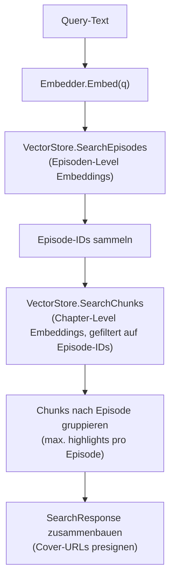
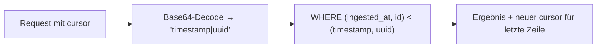
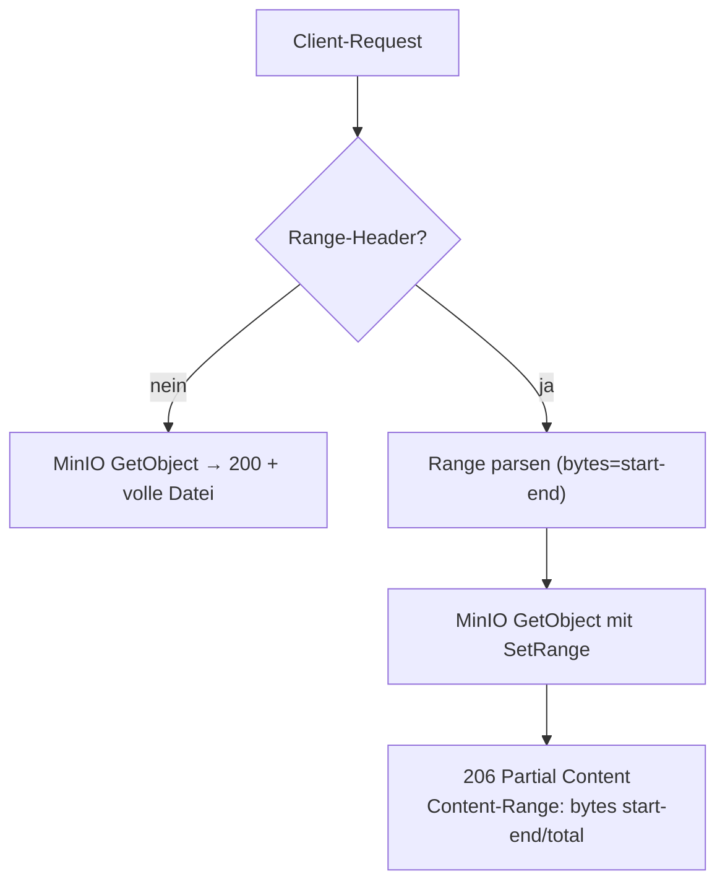
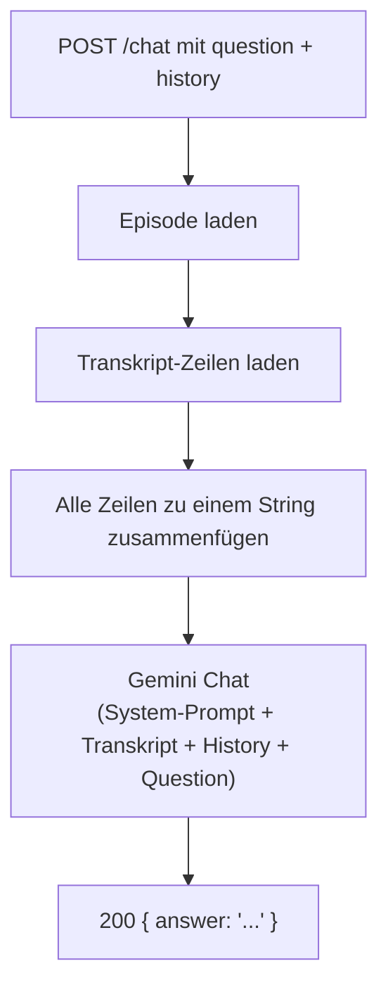

# API-Endpunkte

Alle Endpunkte liegen unter `/api/v1`. Swagger-UI ist verfügbar unter
`http://localhost:8080/swagger/index.html`.

## Routen-Übersicht

| Methode | Pfad                              | Handler          | Beschreibung                                        |
| ------- | --------------------------------- | ---------------- | --------------------------------------------------- |
| GET     | `/health`                         | `HealthCheck`    | Health-Status (DB, MinIO, Embedding)                |
| GET     | `/search`                         | `SemanticSearch` | Semantische Suche über Vektor-Ähnlichkeit           |
| GET     | `/episodes`                       | `ListEpisodes`   | Episoden-Liste (Cursor-Paginierung, Volltextsuche)  |
| GET     | `/episodes/:id`                   | `GetEpisode`     | Episoden-Detail (Header-Bereich)                    |
| GET     | `/episodes/:id/chapters`          | `GetChapters`    | Kapitel einer Episode                               |
| GET     | `/episodes/:id/transcript`        | `GetTranscript`  | Transkript-Zeilen einer Episode                     |
| GET     | `/episodes/:id/fact-checks`       | `GetFactChecks`  | Fact-Check-Claims einer Episode                     |
| GET     | `/episodes/:id/audio`             | `StreamAudio`    | Audio-Stream (Proxy zu MinIO)                       |
| GET     | `/episodes/:id/sync`              | `SyncPlayback`   | SSE-Stream für Playback-Synchronisation             |
| POST    | `/episodes/:id/chat`              | `Chat`           | LLM-Chat über Episoden-Transkript                   |

Alle `:id`-Routen verwenden die `ValidateUUID("id")`-Middleware, die ungültige UUIDs mit
`400 invalid_id` abweist, bevor der Handler überhaupt aufgerufen wird.

---

## 1) Health Check

```
GET /api/v1/health
```

Prüft die Erreichbarkeit aller angebundenen Dienste.

| Dienst    | Prüfung                                  |
| --------- | ---------------------------------------- |
| Database  | `db.Ping()`                              |
| MinIO     | `BucketExists(bucket)`                   |
| Embedding | `embedder.HealthCheck()` (embed "ping")  |

**Response `200`** — alle Dienste erreichbar:
```json
{
  "status": "UP",
  "database": "UP",
  "minio": "UP",
  "embedding": "UP"
}
```

**Response `503`** — mindestens ein Dienst nicht erreichbar:
```json
{
  "status": "DEGRADED",
  "database": "UP",
  "minio": "DOWN",
  "embedding": "UP"
}
```

---

## 2) Semantische Suche

```
GET /api/v1/search?q=...&limit=...&highlights=...&min_score=...
```

Sucht Episoden und Transkript-Chunks anhand einer natürlichsprachlichen Anfrage über
Vektor-Ähnlichkeit (Cosine Distance via pgvector).

### Query-Parameter

| Parameter    | Typ    | Default | Max | Bedeutung                                  |
| ------------ | ------ | ------- | --- | ------------------------------------------ |
| `q`          | string | —       | —   | Suchanfrage (Pflicht)                      |
| `limit`      | int    | `10`    | 50  | Max. Anzahl Episoden-Treffer               |
| `highlights` | int    | `3`     | 10  | Max. Highlights (Chunks) pro Episode       |
| `min_score`  | float  | `0.73`  | 1.0 | Minimaler Ähnlichkeits-Score (0.0 - 1.0)   |

### Ablauf



**Response `200`**:
```json
{
  "query": "Künstliche Intelligenz",
  "items": [
    {
      "episode_id": "uuid",
      "title": "...",
      "podcast_name": "...",
      "cover_url": "https://...",
      "score": 0.87,
      "highlights": [
        { "text": "...", "start_time": 42.5, "score": 0.91 }
      ]
    }
  ],
  "total": 3
}
```

| Status | Bedeutung                              |
| ------ | -------------------------------------- |
| `200`  | Ergebnis (kann leer sein: `items: []`) |
| `400`  | `q` fehlt                              |
| `503`  | Embedding- oder Such-Service down      |

---

## 3) Episode-Liste

```
GET /api/v1/episodes?q=...&cursor=...&limit=...
```

Cursor-basierte Paginierung, sortiert nach `ingested_at DESC`.

### Query-Parameter

| Parameter | Typ    | Default | Max | Bedeutung                                       |
| --------- | ------ | ------- | --- | ----------------------------------------------- |
| `q`       | string | —       | —   | Volltextsuche auf Episoden-Titel + Podcast-Name |
| `cursor`  | string | —       | —   | Cursor aus vorheriger Antwort (`next_cursor`)   |
| `limit`   | int    | `20`    | 100 | Seitengröße                                     |

### Cursor-Logik

Der Cursor ist ein Base64-kodierter String der Form `<ingested_at>|<episode_id>`. Er ermöglicht
stabile Paginierung auch bei gleichzeitigen Einfügungen, weil er auf `(ingested_at, id)` als
Sortier-Schlüssel basiert statt auf einem Offset.



**Response `200`**:
```json
{
  "items": [
    {
      "id": "uuid",
      "title": "...",
      "podcast_name": "...",
      "duration_seconds": 3600,
      "published_at": "2026-01-15",
      "cover_url": "https://...",
      "summary": "...",
      "processing_complete": true
    }
  ],
  "next_cursor": "MjAyNi0wMS0xNS4uLnx1dWlk",
  "total": 42
}
```

- `next_cursor` ist `null`, wenn es keine weiteren Seiten gibt (weniger als `limit` Ergebnisse).
- `processing_complete` ist `true`, wenn der letzte Pipeline-Batch der Episode `fact_checker`
  mit Status `success` oder `consumed` ist.
- Cover-URLs: Wenn ein `cover_key` existiert, wird eine Presigned MinIO-URL erzeugt (1h Gültigkeit).
  Fallback: `podcasts.image_url` (externe URL des Podcast-Feeds).

---

## 4) Episode-Detail

```
GET /api/v1/episodes/:id
```

Liefert Detaildaten für den Header-Bereich der Episoden-Ansicht.

**Response `200`**:
```json
{
  "episode": {
    "id": "uuid",
    "title": "...",
    "podcast_name": "...",
    "duration_seconds": 3600,
    "published_at": "2026-01-15",
    "cover_url": "https://...",
    "audio_url": "/api/v1/episodes/uuid/audio",
    "summary": "...",
    "processing_complete": true
  }
}
```

- `audio_url` ist ein relativer Pfad zum Audio-Streaming-Endpunkt (nur gesetzt, wenn `audio_key`
  vorhanden ist). Das Frontend nutzt diesen Pfad als `<audio src="...">`.

| Status | Bedeutung                    |
| ------ | ---------------------------- |
| `200`  | Episode gefunden             |
| `400`  | Ungültige UUID               |
| `404`  | Episode existiert nicht      |

---

## 5) Kapitel

```
GET /api/v1/episodes/:id/chapters
```

**Response `200`**:
```json
{
  "episode_id": "uuid",
  "chapters": [
    {
      "id": "uuid",
      "chapter_idx": 0,
      "title": "Einleitung",
      "summary": "...",
      "start_time": 0.0,
      "end_time": 120.5
    }
  ]
}
```

**Response `202`** (kein Body): Segmentierung noch nicht abgeschlossen — das Frontend kann
später erneut anfragen.

---

## 6) Transkript

```
GET /api/v1/episodes/:id/transcript
```

**Response `200`**:
```json
{
  "episode_id": "uuid",
  "lines": [
    {
      "id": "uuid",
      "chapter_id": "uuid",
      "start_time": 0.0,
      "end_time": 3.2,
      "text": "Willkommen zum Podcast!",
      "emotion": "happy",
      "emotion_score": 0.85,
      "has_fact_flag": false
    }
  ]
}
```

- `emotion`: Label aus dem Emotion Analyser (Default: `"neutral"`).
- `emotion_score`: Konfidenz des Emotion-Modells (Default: `0`).
- `has_fact_flag`: `true`, wenn für das Kapitel dieser Zeile mindestens ein Fact-Check-Claim
  existiert. Wird per `EXISTS`-Subquery bestimmt (nicht per Join).
- Sortierung: `chapter_idx ASC, line_idx ASC`.

---

## 7) Fact-Checks

```
GET /api/v1/episodes/:id/fact-checks
```

**Response `200`**:
```json
{
  "episode_id": "uuid",
  "claims": [
    {
      "id": "uuid",
      "chapter_id": "uuid",
      "claim_idx": 0,
      "claim": "Deutschland hat 83 Millionen Einwohner.",
      "verdict": "TRUE",
      "explanation": "...",
      "sources": ["https://..."]
    }
  ]
}
```

- `verdict`: `TRUE`, `MOSTLY_TRUE`, `MISLEADING`, `FALSE` oder `UNVERIFIABLE`.
- `sources`: PostgreSQL-Array, im JSON als String-Array serialisiert.
- Leere Claims-Liste: `claims: []` (nie `null`).

---

## 8) Audio-Streaming

```
GET /api/v1/episodes/:id/audio
```

Proxy-Endpunkt, der die Audio-Datei direkt aus MinIO an den Client streamt.
Unterstützt HTTP-Range-Requests für Seeking im Audio-Player.



| Header           | Wert (Beispiel)                     |
| ---------------- | ----------------------------------- |
| `Content-Type`   | `audio/mpeg` (aus MinIO oder Fallback) |
| `Accept-Ranges`  | `bytes`                             |
| `Content-Length`  | Dateigröße bzw. Segment-Länge       |
| `Content-Range`  | `bytes 0-999/50000` (nur bei 206)   |

| Status | Bedeutung                                |
| ------ | ---------------------------------------- |
| `200`  | Volle Datei                              |
| `206`  | Teilausschnitt (Range-Request)           |
| `404`  | Episode oder Audio-Datei nicht gefunden  |
| `416`  | Ungültiger Range                         |

---

## 9) Playback-Synchronisation (SSE)

```
GET /api/v1/episodes/:id/sync
```

Server-Sent Events Stream. Aktuell ein **Stub**, der fünf hart kodierte Positionen
(0s, 30s, 60s, 90s, 120s) ausgibt und dann ein `analysis_ready`-Event sendet.

**Events:**

```text
event: position
data: {"current_time":30,"active_transcript_line_id":"","progress_percent":2.5}

event: analysis_ready
data: {"episode_id":"uuid"}
```

| Header          | Wert                 |
| --------------- | -------------------- |
| `Content-Type`  | `text/event-stream`  |
| `Cache-Control` | `no-cache`           |
| `Connection`    | `keep-alive`         |

---

## 10) Chat

```
POST /api/v1/episodes/:id/chat
```

LLM-basierter Chat über das Transkript einer Episode. Nutzt Gemini (`gemini-2.5-flash-lite`)
mit einem festen System-Prompt, der das LLM anweist, ausschließlich auf Basis des Transkripts
zu antworten.

### Request-Body

```json
{
  "question": "Worum geht es in der Episode?",
  "history": [
    { "role": "user", "content": "Wer sind die Gäste?" },
    { "role": "assistant", "content": "Die Gäste sind..." }
  ]
}
```

| Feld       | Typ               | Pflicht | Validierung                  |
| ---------- | ----------------- | ------- | ---------------------------- |
| `question` | string            | ja      | max. 10.000 Zeichen          |
| `history`  | `[]ChatMessage`   | nein    | `role` ∈ `user`, `assistant` |

### Ablauf



**Response `200`**:
```json
{ "answer": "In der Episode geht es um..." }
```

| Status | Bedeutung                                       |
| ------ | ----------------------------------------------- |
| `200`  | Antwort generiert                               |
| `400`  | Ungültiger Request-Body                         |
| `404`  | Episode oder Transkript nicht gefunden           |
| `503`  | LLM-Service nicht verfügbar                      |

---

## Fehler-Format

Alle Fehler-Responses folgen demselben Schema:

```json
{
  "error": "error_code",
  "message": "Menschenlesbare Fehlermeldung.",
  "status": 404
}
```

| Feld      | Typ    | Bedeutung                                |
| --------- | ------ | ---------------------------------------- |
| `error`   | string | Maschinenlesbarer Fehlercode             |
| `message` | string | Menschenlesbare Beschreibung (deutsch)   |
| `status`  | int    | HTTP-Status-Code (redundant, aber nützlich für Clients) |

### Häufige Fehlercodes

| Code                    | Status | Wann                                              |
| ----------------------- | ------ | ------------------------------------------------- |
| `invalid_id`            | 400    | UUID-Parameter hat ungültiges Format               |
| `episode_not_found`     | 404    | Episode mit dieser ID existiert nicht               |
| `audio_not_found`       | 404    | Keine Audio-Datei für diese Episode vorhanden       |
| `transcript_not_found`  | 404    | Kein Transkript vorhanden                           |
| `internal_error`        | 500    | Unerwarteter Server-Fehler                          |
| `MISSING_QUERY`         | 400    | Such-Query `q` fehlt                               |
| `EMBEDDING_UNAVAILABLE` | 503    | Embedding-Service nicht erreichbar                  |
| `SEARCH_UNAVAILABLE`    | 503    | Such-Service nicht erreichbar                       |
| `LLM_UNAVAILABLE`       | 503    | LLM-Service nicht erreichbar                        |
| `invalid_request`       | 400    | Ungültiger Request-Body (Chat)                     |
