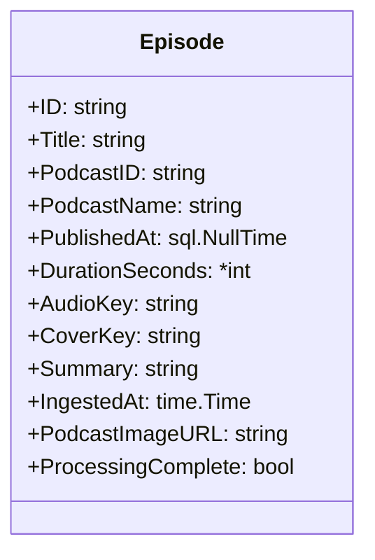
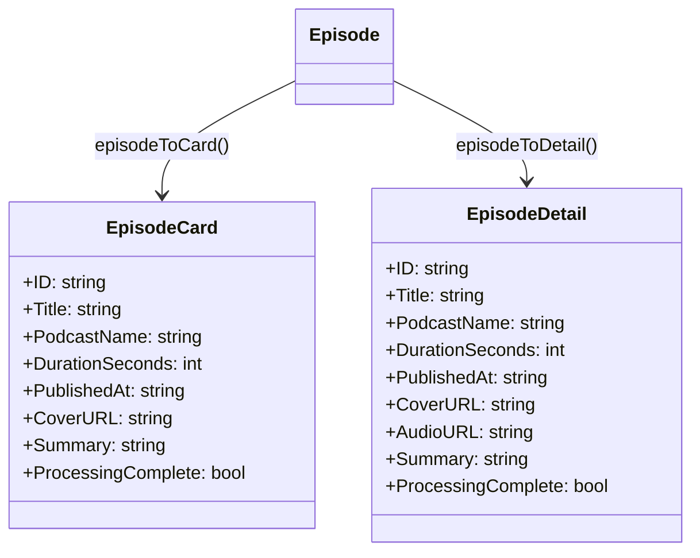
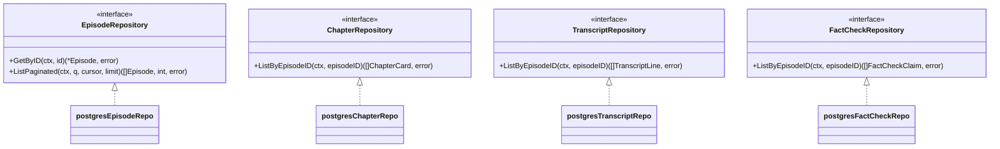
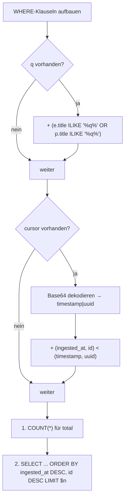
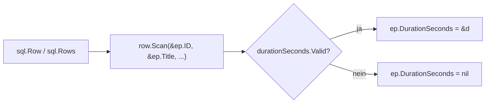

# Datenmodelle & Datenbankzugriff

## Connection-Pool

Die Datenbankverbindung wird in `database/postgres.go` konfiguriert:

| Parameter            | Wert        | Bedeutung                                          |
| -------------------- | ----------- | -------------------------------------------------- |
| `MaxOpenConns`       | `25`        | Max. gleichzeitig offene Verbindungen              |
| `MaxIdleConns`       | `5`         | Max. Verbindungen im Idle-Pool                     |
| `ConnMaxLifetime`    | `5 min`     | Maximale Lebenszeit einer Verbindung               |

- Treiber: `lib/pq` (reiner Go-Treiber, kein CGO nötig).
- `DB` ist ein Typ-Alias für `sql.DB` — kein eigener Wrapper, volle Kompatibilität mit
  `database/sql`-Idiomen.

## Datenmodelle (`model/models.go`)

Das Backend definiert zwei Kategorien von Modellen:

1. **DB-Entities**: Bilden die Datenbankzeilen ab (z. B. `Episode`).
2. **API-Response-Schemas**: Vereinfachte Darstellungen für die JSON-Antwort (z. B. `EpisodeCard`,
   `EpisodeDetail`).

### Entity: Episode



| Feld                 | DB-Spalte / Quelle                                | Bemerkung                                            |
| -------------------- | ------------------------------------------------- | ---------------------------------------------------- |
| `PodcastName`        | `podcasts.title` (JOIN)                           | Nicht in `episodes`, sondern via JOIN geholt          |
| `PodcastImageURL`    | `podcasts.image_url` (JOIN)                       | Fallback für Cover-URL, `json:"-"` (nie im Response) |
| `ProcessingComplete` | Berechnet aus `pipeline_batches`                  | `true` wenn `stage='fact_checker'` + `status IN ('success','consumed')` |
| `DurationSeconds`    | `episodes.duration_seconds` (nullable)            | Pointer, weil die Spalte `NULL` sein kann             |
| `AudioKey`           | `episodes.audio_key`                              | Pfad in MinIO (z. B. `podcasts/xyz/episode.mp3`)     |
| `CoverKey`           | `episodes.cover_key`                              | Pfad in MinIO für das Cover-Bild                     |

### Response-Schemas



- `EpisodeCard` wird für die Listen-Ansicht verwendet. `CoverURL` ist eine Presigned MinIO-URL
  oder die externe Podcast-Image-URL.
- `EpisodeDetail` enthält zusätzlich `AudioURL` (relativer Pfad zum Audio-Streaming-Endpunkt).
- Beide haben `PublishedAt` als `string` (formatiert als `"2006-01-02"`), nicht als `time.Time`.

### Weitere Modelle

| Modell              | Zweck                                             | Besonderheiten                              |
| ------------------- | ------------------------------------------------- | ------------------------------------------- |
| `ChapterCard`       | Kapitel einer Episode (für Kapitel-Tab)           | Sortiert nach `chapter_idx`                 |
| `TranscriptLine`    | Einzelne Transkript-Zeile                         | Enthält `emotion`, `emotion_score`, `has_fact_flag` |
| `FactCheckClaim`    | Ein Fact-Check-Claim                              | `Sources` als `[]string` (aus PG-Array)     |
| `ChatMessage`       | Ein Chat-Nachricht (User oder Assistant)          | `role` validiert: `user` oder `assistant`   |
| `ChatRequest`       | Request-Body für Chat-Endpunkt                    | `question` max. 10.000 Zeichen              |
| `ChatResponse`      | Antwort des Chat-Endpunkts                        | Nur `answer: string`                        |
| `SSEPositionEvent`  | Playback-Position (SSE)                           | `progress_percent` berechnet aus Duration   |
| `SearchHighlight`   | Ein Treffer-Chunk in der semantischen Suche       | `text`, `start_time`, `score`               |
| `SearchResultItem`  | Episoden-Treffer mit Highlights                   | Aggregiert Episode + zugehörige Chunks      |
| `SearchResponse`    | Gesamte Such-Antwort                              | `query`, `items`, `total`                   |
| `ApiError`          | Einheitliches Fehler-Format                       | Immer `error`, `message`, `status`          |
| `HealthStatus`      | Health-Check-Antwort                              | Status pro Dienst (DB, MinIO, Embedding)    |

## Repositories

Jedes Repository ist ein Interface mit einer PostgreSQL-Implementierung. Die Interfaces
erlauben Testbarkeit (Mock-Injection), werden im Projekt aber nicht mit Mocks verwendet.



### EpisodeRepository

#### `GetByID(ctx, id)`

Lädt eine einzelne Episode mit allen Metadaten. Das SQL JOINt drei Tabellen:

```sql
SELECT e.id, e.title, e.podcast_id, p.title,
       e.published_at, e.duration_seconds,
       COALESCE(e.audio_key, ''), COALESCE(e.cover_key, ''),
       COALESCE(e.summary, ''), e.ingested_at,
       COALESCE(p.image_url, ''),
       (pb.stage = 'fact_checker' AND pb.status IN ('success', 'consumed'))
         AS processing_complete
FROM episodes e
JOIN podcasts p ON p.id = e.podcast_id
JOIN pipeline_batches pb ON pb.id = e.batch_id
WHERE e.id = $1
  AND pb.stage IN ('transcription', 'segmenting', 'text_summarizer',
                    'emotion_scoring', 'embedder', 'fact_checker')
  AND pb.status IN ('success', 'consumed')
```

- **`pipeline_batches`-Filter**: Nur Episoden, deren Batch in einem der bekannten Stages mit
  Status `success` oder `consumed` ist, werden als "existierend" betrachtet. Eine Episode, die
  gerade verarbeitet wird (`pending`) oder gescheitert ist (`failed`), ist über die API nicht
  sichtbar.
- **`processing_complete`**: Ist `true`, wenn die Episode den letzten Pipeline-Step
  (`fact_checker`) erfolgreich durchlaufen hat. Das Frontend nutzt dies, um unvollständig
  verarbeitete Episoden zu kennzeichnen.

#### `ListPaginated(ctx, q, cursor, limit)`

Cursor-basierte Paginierung mit optionaler Volltextsuche.



- **Suchlogik**: `ILIKE` (case-insensitive) auf Episoden-Titel und Podcast-Name. Kein
  Fulltext-Index, sondern einfacher Pattern-Match. Bei großen Datenmengen wäre `tsvector`/`tsquery`
  performanter, für den Uni-Kontext reicht `ILIKE`.
- **Cursor**: Base64-kodierter String `"<ingested_at>|<uuid>"`. Der Query filtert mit
  `(ingested_at, id) < (timestamp, uuid)` — stabil auch bei gleichzeitigen Einfügungen.
- **Limit-Enforcement**: `ParseLimit()` erzwingt Grenzen (Default: 20, Max: 100).

### ChapterRepository

#### `ListByEpisodeID(ctx, episodeID)`

```sql
SELECT id, chapter_idx, COALESCE(title, ''), COALESCE(summary, ''),
       start_time, end_time
FROM chapters
WHERE episode_id = $1
ORDER BY chapter_idx ASC
```

- `COALESCE`: `title` und `summary` können `NULL` sein (wenn `text_summarizer` noch nicht
  gelaufen ist).
- Sortierung nach `chapter_idx` stellt die richtige Reihenfolge sicher.

### TranscriptRepository

#### `ListByEpisodeID(ctx, episodeID)`

```sql
SELECT tl.id, tl.chapter_id, tl.start_time, tl.end_time, tl.text,
       COALESCE(tl.emotion::text, 'neutral'),
       COALESCE(tl.emotion_score, 0),
       EXISTS(SELECT 1 FROM fact_checked_claims fc
              WHERE fc.chapter_id = tl.chapter_id)
FROM transcript_lines tl
JOIN chapters ch ON ch.id = tl.chapter_id
WHERE ch.episode_id = $1
ORDER BY ch.chapter_idx, tl.line_idx
```

- **`emotion`**: PostgreSQL-Enum, wird zu `text` gecastet. Default: `'neutral'`.
- **`has_fact_flag`**: Korrelierte `EXISTS`-Subquery — `true`, wenn mindestens ein Fact-Check-
  Claim für das Kapitel dieser Zeile existiert. Das ist absichtlich auf Kapitel-Ebene, nicht auf
  Zeilen-Ebene, weil Claims an Kapiteln hängen, nicht an einzelnen Transkript-Zeilen.
- **Sortierung**: Erst nach Kapitel-Index, dann nach Zeilen-Index innerhalb des Kapitels.

### FactCheckRepository

#### `ListByEpisodeID(ctx, episodeID)`

```sql
SELECT fc.id, fc.chapter_id, COALESCE(fc.claim_idx, 0),
       COALESCE(fc.claim, ''), fc.verdict::text,
       COALESCE(fc.explanation, ''), COALESCE(fc.sources, '{}')
FROM fact_checked_claims fc
JOIN chapters ch ON ch.id = fc.chapter_id
WHERE ch.episode_id = $1
ORDER BY ch.chapter_idx, fc.claim_idx
```

- **`sources`**: PostgreSQL-Array (`text[]`), wird über `pq.Array(&c.Sources)` in ein
  Go-`[]string` gescannt. `COALESCE(fc.sources, '{}')` verhindert `NULL`-Array-Fehler.
- **`verdict`**: PostgreSQL-Enum → `::text`-Cast.

## Scan-Funktionen

Die Repository-Implementierungen verwenden dedizierte `scanEpisode` / `scanEpisodes`-Funktionen,
um die `sql.Row`/`sql.Rows`-Objekte in Go-Structs zu überführen. Dabei wird `sql.NullInt64` für
`duration_seconds` genutzt, weil die Spalte nullable ist und ein `*int` als Zieltyp erwartet wird.



## Hilfsfunktionen

| Funktion         | Datei            | Zweck                                                   |
| ---------------- | ---------------- | ------------------------------------------------------- |
| `EncodeCursor`   | `repository.go`  | Episode → Base64-Cursor für Paginierung                  |
| `ParseLimit`     | `repository.go`  | String → int mit Default + Max-Grenze                    |
| `formatDate`     | `podcasts.go`    | `sql.NullTime` → `"2006-01-02"` oder `""`               |
| `episodeToCard`  | `podcasts.go`    | `Episode` → `EpisodeCard` (mit Cover-URL-Auflösung)     |
| `episodeToDetail`| `podcasts.go`    | `Episode` → `EpisodeDetail` (mit Audio-URL + Cover-URL) |
