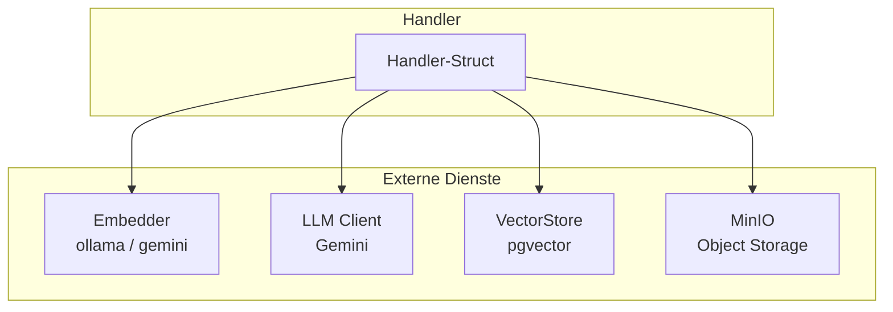
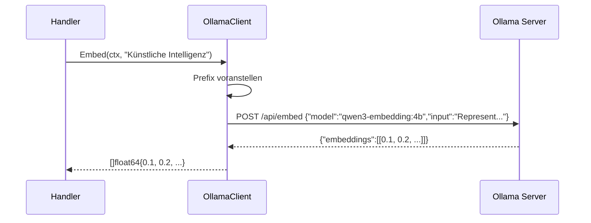
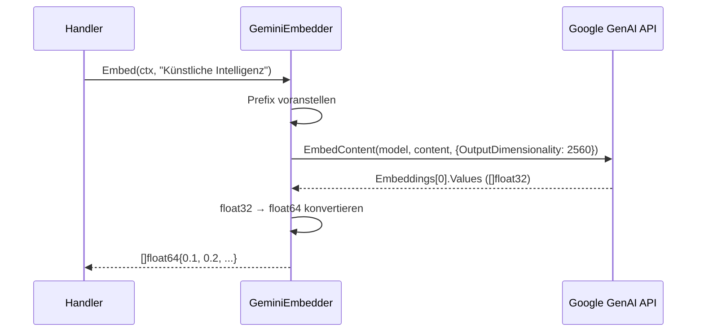
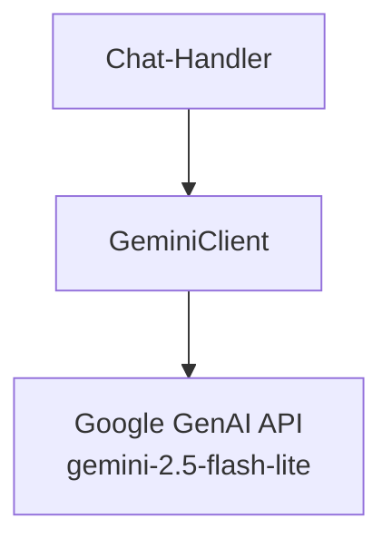
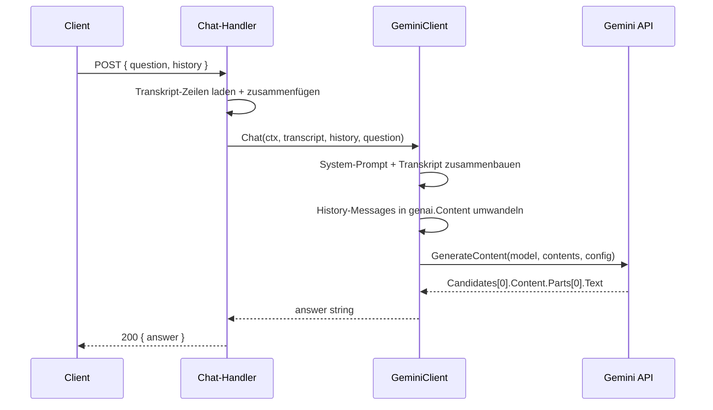
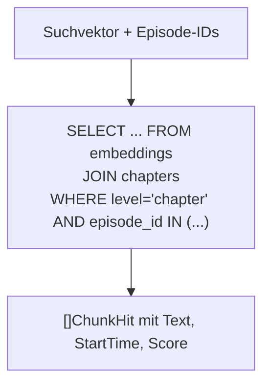
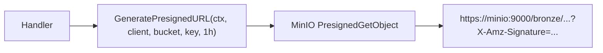
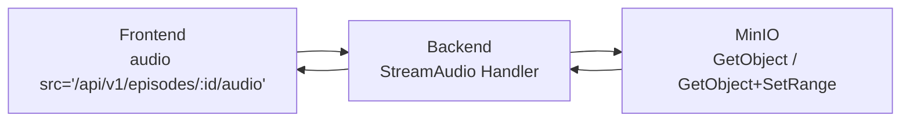

# Externe Dienste

Das Backend bindet vier externe Systeme an. Jedes ist in einem eigenen Package gekapselt.



---

## 1) Embedder (`internal/embedder/`)

Wandelt Text in Vektor-Repräsentationen um. Wird für die semantische Suche benötigt:
Die Suchanfrage des Users wird embedded und dann mit den gespeicherten Episoden-/Kapitel-
Embeddings verglichen.

### Interface

```go
type Embedder interface {
    Embed(ctx context.Context, text string) ([]float64, error)
    HealthCheck(ctx context.Context) error
}
```

### Provider-Strategie

```mermaid
flowchart TD
    CFG{EMBEDDING_PROVIDER?} -->|"gemini"| GE["GeminiEmbedder<br/>Google GenAI API"]
    CFG -->|"ollama" (Default)| OE["OllamaClient<br/>Lokaler HTTP-Server"]
```

| Provider | Klasse           | Modell (Default)        | Verbindung                     |
| -------- | ---------------- | ----------------------- | ------------------------------ |
| `ollama` | `OllamaClient`   | `qwen3-embedding:4b`   | HTTP POST zu `OLLAMA_URL/api/embed` |
| `gemini` | `GeminiEmbedder`  | Konfigurierbar          | Google GenAI SDK (`genai.Client`) |

### Task Instruction

Beiden Providern wird der Text mit einem festen Instruktions-Präfix vorangestellt:

```text
Represent this podcast transcript segment for semantic retrieval: {text}
```

Dieser Präfix ist identisch mit dem, der in der Processing-Pipeline beim Erstellen der
Embeddings verwendet wird (`transcript_embedder`). Das ist kritisch: Wäre der Präfix
unterschiedlich, würden die Suchanfrage-Vektoren nicht zu den gespeicherten Embedding-Vektoren
passen, und die semantische Suche würde schlechte Ergebnisse liefern.

### Ollama-Implementierung



- HTTP-Client mit 30s Timeout.
- `HealthCheck`: GET auf `OLLAMA_URL/` — prüft nur, ob der Server erreichbar ist, nicht ob das
  Modell geladen ist.

### Gemini-Implementierung



- `OutputDimensionality` wird aus `EMBEDDING_DIMENSION` gesetzt (Default: 2560).
  Muss mit der Spaltenbreite `embeddings.embedding halfvec(2560)` in PostgreSQL übereinstimmen.
- Die API liefert `float32`, das Backend konvertiert zu `float64` für Kompatibilität mit pgvector-go.
- `HealthCheck`: Embeddet den String `"ping"` — ein leichtgewichtiger API-Aufruf zur
  Erreichbarkeitsprüfung.

---

## 2) LLM Client (`internal/llm/`)

Wird für den Chat-Endpunkt verwendet. Der User kann Fragen zu einer Episode stellen, die
ausschließlich auf Basis des Transkripts beantwortet werden.

### Architektur



| Feld     | Wert                                    |
| -------- | --------------------------------------- |
| Modell   | `gemini-2.5-flash-lite` (hart kodiert)  |
| API-Key  | `GEMINI_API_KEY` (Umgebungsvariable)    |

### System-Prompt

```text
You are a podcast analysis assistant. You answer questions about a podcast episode
based ONLY on its transcript provided below.

Rules:
- Answer exclusively based on the transcript content
- If the transcript does not contain enough information to answer the question, say so clearly
- Be concise and direct
- When relevant, reference specific parts of the transcript
- Answer in the same language the question was asked in
```

Das vollständige Transkript wird an den System-Prompt angehängt (`TRANSCRIPT:\n{text}`).

### Chat mit History



- Die Chat-History (`[]ChatMessage`) wird als `genai.Content`-Liste an die API übergeben.
  `role: "user"` bleibt `"user"`, `role: "assistant"` wird zu `"model"` (Gemini-Konvention).
- Methoden: `Ask(ctx, transcript, question)` ist ein Shortcut für `Chat(ctx, transcript, nil, question)`.

---

## 3) VectorStore (`internal/vectorstore/`)

Führt Vektor-Ähnlichkeitssuchen auf den in der Processing-Pipeline erzeugten Embeddings durch.
Nutzt die `pgvector`-Extension in PostgreSQL.

### Datentypen

```go
type EpisodeHit struct {
    EpisodeID          string
    Title              string
    PodcastName        string
    CoverKey           string
    PodcastImageURL    string
    Score              float64
    ProcessingComplete bool
}

type ChunkHit struct {
    EpisodeID string
    Text      string
    StartTime float64
    Score     float64
}
```

### SearchEpisodes

Sucht auf **Episoden-Level-Embeddings** (`emb.level = 'episode'`).

```sql
SELECT e.id, e.title, p.title, COALESCE(e.cover_key, ''),
       COALESCE(p.image_url, ''),
       1 - (emb.embedding <=> $1::halfvec) AS score,
       (pb.stage = 'fact_checker' AND pb.status IN ('success', 'consumed'))
FROM embeddings emb
JOIN episodes e ON e.id = emb.episode_id
JOIN podcasts p ON p.id = e.podcast_id
JOIN pipeline_batches pb ON pb.id = e.batch_id
WHERE emb.level = 'episode'
  AND pb.stage IN (...) AND pb.status IN ('success', 'consumed')
  AND 1 - (emb.embedding <=> $1::halfvec) >= $2
ORDER BY emb.embedding <=> $1::halfvec
LIMIT $3
```

- **Distanzmetrik**: Cosine Distance (`<=>`). Score = `1 - distance` (je höher, desto ähnlicher).
- **Datentyp**: `halfvec` (16-bit Floating Point), kompakter als `vector` (32-bit).
  Die Konvertierung `float64 → float32` geschieht über eine Hilfsfunktion `toFloat32`.
- **Pipeline-Filter**: Gleicher Filter wie in den Repositories — nur erfolgreich verarbeitete
  Episoden sind suchbar.
- **Min-Score-Filter**: Ergebnisse unterhalb des `min_score`-Schwellenwerts werden direkt in
  SQL gefiltert (keine nachträgliche Filterung in Go).

### SearchChunks

Sucht auf **Chapter-Level-Embeddings** (`emb.level = 'chapter'`), eingeschränkt auf eine
vorgegebene Menge von Episode-IDs.



- Die Episode-IDs kommen aus dem vorherigen `SearchEpisodes`-Aufruf.
- `LIMIT` wird als `limit × highlights` gesetzt (z. B. `10 × 3 = 30`), damit für jede Episode
  genug Chunks vorhanden sind.
- Dynamische Placeholder-Generierung für die `IN (...)`-Klausel (kein ORM, reines SQL).

---

## 4) MinIO (`internal/storage/`)

Object Storage für Audio-Dateien und Cover-Bilder. Das Backend liest nur, es schreibt nie.

### Client-Erstellung

```go
client, err := minio.New(cfg.MinioEndpoint, &minio.Options{
    Creds:        credentials.NewStaticV4(cfg.MinioUser, cfg.MinioPass, ""),
    Secure:       cfg.MinioUseSSL,
    BucketLookup: minio.BucketLookupPath,
})
```

- `BucketLookupPath`: Path-Style statt Virtual-Host-Style URLs. Nötig für lokale MinIO-Instanzen,
  die keinen DNS-basierten Bucket-Lookup unterstützen.

### Verwendung im Backend

| Funktion              | Wo verwendet               | Zweck                                          |
| --------------------- | -------------------------- | ---------------------------------------------- |
| `GeneratePresignedURL`| Episode-Liste, Detail, Suche | Cover-Bilder als temporäre URLs (1h Gültigkeit)|
| `StatObject`          | Audio-Handler              | Dateigröße + Content-Type ermitteln            |
| `GetObject`           | Audio-Handler              | Audio-Stream (voll oder Range)                 |
| `BucketExists`        | Health-Check               | MinIO-Erreichbarkeit prüfen                    |

### Presigned URLs



- Presigned URLs haben eine feste Gültigkeit von **1 Stunde**.
- Das Frontend erhält die Presigned URL direkt im JSON-Response und kann sie als ``
  verwenden.
- Fallback: Wenn kein `cover_key` vorhanden ist, aber ein `podcast_image_url` (externe URL aus
  dem RSS-Feed), wird dieser als `cover_url` verwendet.

### Audio-Streaming

Für Audio-Dateien werden **keine** Presigned URLs verwendet. Stattdessen fungiert der
Backend-Server als Proxy:



Das hat den Vorteil, dass der MinIO-Endpunkt nicht direkt vom Client erreichbar sein muss.
Range-Requests werden 1:1 an MinIO weitergeleitet (siehe [02_api_endpoints.md](02_api_endpoints.md)).
