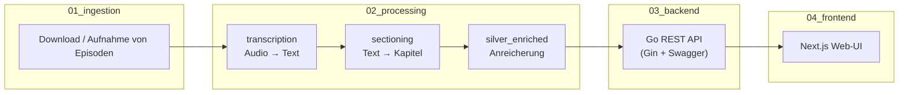
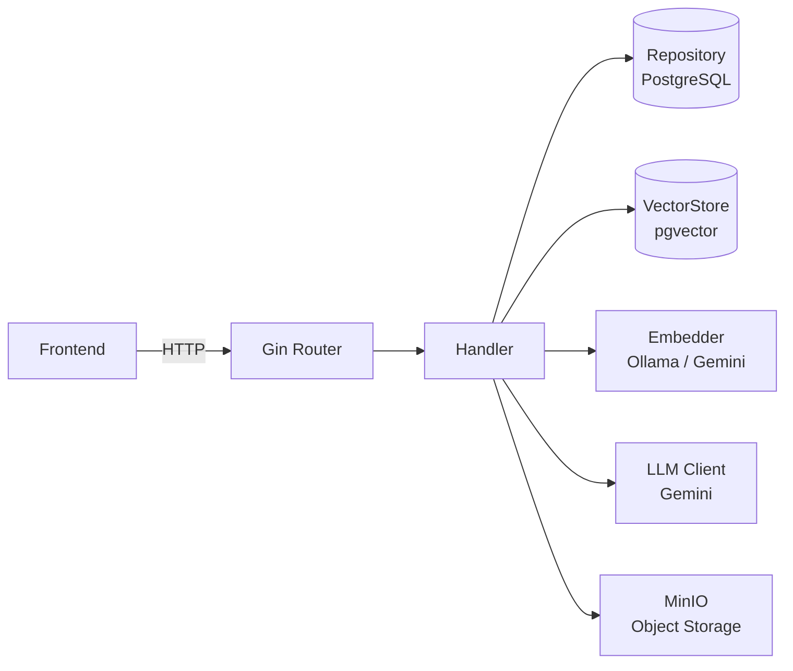

# Backend - Übersicht

> Diese Doku-Reihe beschreibt das **Backend** im `media-lens`-Projekt.
> Es liegt im Code unter [`src/backend/`](../../src/backend/).

## Was ist das Backend?

Das Backend ist die HTTP-API-Schicht der Media-Lens-Plattform. Es nimmt die von der
Processing-Pipeline (Silver Enriched) angereicherten Daten aus PostgreSQL und stellt sie dem
Frontend als REST-API bereit. Zusätzlich bietet es:

- Cursor-basierte Paginierung und Volltextsuche für Episoden
- Semantische Suche über Vektor-Embeddings (pgvector)
- LLM-gestützten Chat über Episoden-Transkripte (Gemini)
- Audio-Streaming mit Range-Request-Support (Proxy zu MinIO)
- Server-Sent Events für Playback-Synchronisation
- Health-Checks für alle angebundenen Dienste

## Wo befinden wir uns in der Gesamt-Pipeline?

- **Silver Enriched** schreibt Zusammenfassungen, Fakten-Checks, Embeddings und Emotionsdaten
  in PostgreSQL / pgvector.
- **Das Backend** liest diese Daten und stellt sie über eine typisierte REST-API bereit.
  Es schreibt **nicht** in die Datenbank (rein lesend), führt aber zur Laufzeit eigene
  Embedding- und LLM-Aufrufe durch (für semantische Suche und Chat).
- **Das Frontend** konsumiert ausschließlich die Backend-API.

## Inhalt dieser Doku-Reihe

| Datei                                        | Inhalt                                                          |
| -------------------------------------------- | --------------------------------------------------------------- |
| [01_architecture.md](01_architecture.md)     | Projektstruktur, Schichten-Architektur, Startup & Shutdown      |
| [02_api_endpoints.md](02_api_endpoints.md)   | Alle API-Routen im Detail: Parameter, Responses, Status-Codes   |
| [03_database.md](03_database.md)             | Datenmodelle, Repositories, SQL-Queries, Connection-Pooling     |
| [04_services.md](04_services.md)             | Externe Dienste: Embedder, LLM, VectorStore, MinIO              |
| [05_configuration.md](05_configuration.md)   | Umgebungsvariablen, Middleware, Swagger, Docker                  |

## Tech Stack

| Komponente       | Technologie                                          |
| ---------------- | ---------------------------------------------------- |
| Sprache          | Go 1.26                                              |
| HTTP-Framework   | Gin v1.12                                            |
| API-Doku         | Swagger (swaggo/swag + gin-swagger)                  |
| Datenbank        | PostgreSQL 16 (lib/pq)                               |
| Vektor-Suche     | pgvector (pgvector-go)                               |
| Object Storage   | MinIO (minio-go/v7)                                  |
| Embedding        | Ollama (HTTP) oder Gemini (google.golang.org/genai)  |
| LLM (Chat)       | Gemini (gemini-2.5-flash-lite)                       |
| CORS             | gin-contrib/cors                                     |

## High-Level-Architektur

---

> Hinweis: Diese Dokumentation wurde mit der Unterstützung von KI (Claude Sonnet 4.6) geschrieben.
