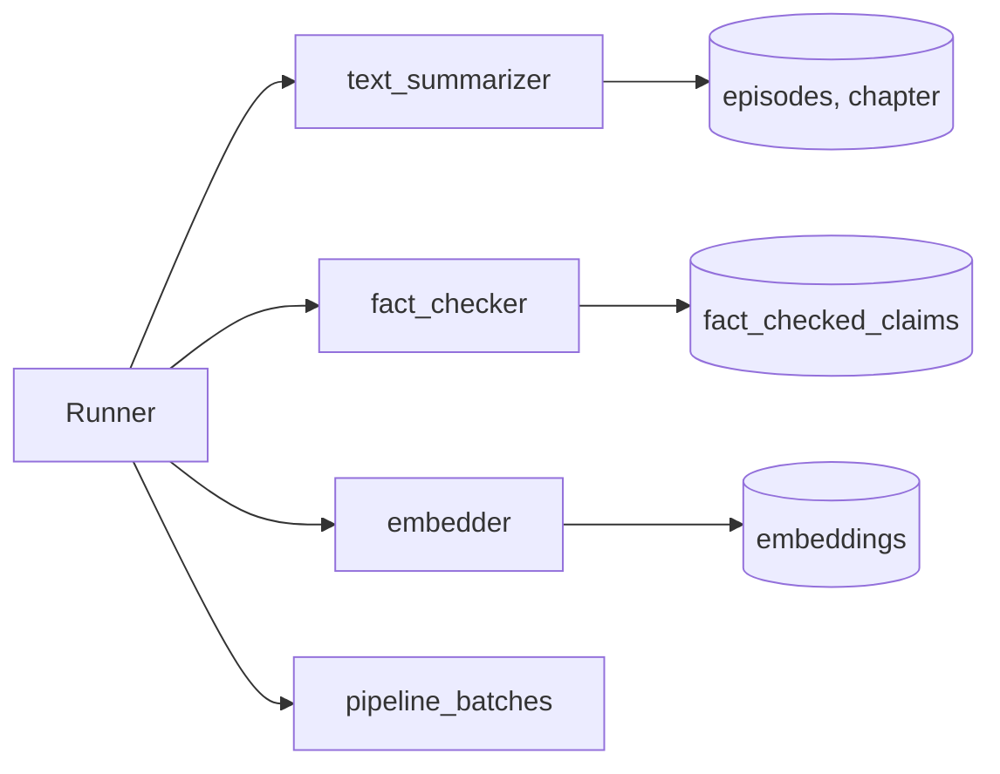

# Silver Enriched Load Strategy (Runner)

## Ziel

Diese Doku beschreibt den aktuellen Runner fuer Silver Enriched: wie Full- und Delta-Loads funktionieren, welche Watermarks verwendet werden und welche Timestamps je Step relevant sind.

## Architektur (Kurzfassung)

- **Runner** orchestriert Stage `processing`, erzeugt einen Batch und ruft die Steps auf.
- **Steps** implementieren fachliche Logik (Text Summarizer, Fact Checker, Embedder).
- **DbConnector** liefert DB-Verbindung, Watermarks und Timestamp-Parsing.
- **Pipeline Utils** kapseln Delta-Selektion, Watermark-Logik und Batch-Handling.



## Technische Felder

Silver Enriched nutzt mehrere technische Timestamps, damit jede Phase ihre eigene Delta-Logik behalten kann:

- `ingested_at`: Zeitpunkt des Inserts.
- `source_system_updated_at`: Zeitstempel aus der Quelle.
- `preprocessing_updated_at`: Letzte Aenderung durch Vorverarbeitung/Segmentierung.
- `processing_updated_at`: Letzte Aenderung durch jeweilige Enrichment-Phase.
- `batch_id`: Verknuepfung zu `pipeline_batches`.

Der Runner erzeugt zu Beginn **einen** `processing_update_ts` (run-scoped), damit alle Writes dieses Laufs denselben Timestamp bekommen.

## Batch-Tracking

Jeder Run schreibt einen Eintrag in `pipeline_batches`:

- `stage`: fuer Silver Enriched in der Regel `processing`.
- `load_mode`: `full` oder `delta`.
- `status`: `pending`, `success`, `failed`.

## Watermark-Logik

- Watermark = `fin_ts` des letzten erfolgreichen Batches der Stage.
- Fallback: `1970-01-01 00:00:00+00:00`.
- Override per `--watermark`.

## Full-Load

Im Full-Load wird **nicht gefiltert**: alle passenden Datensaetze werden verarbeitet.

## Delta-Load (Step-spezifisch)

Delta beruecksichtigt **preprocessing_updated_at** der Quelle und die **processing_updated_at** der jeweiligen Zieltabelle.

Regel (vereinfacht):

```sql
include if preprocessing_updated_at > watermark OR processing_updated_at IS NULL
```

Step-spezifische `processing_updated_at`:

- **text_summarizer**: `chapter.processing_updated_at`
- **fact_checker**: `MAX(fact_checked_claims.processing_updated_at)` pro Kapitel
- **embedder**:
  - Chapter: `MAX(embeddings.processing_updated_at)` fuer `level='chapter'`
  - Episode: `MAX(embeddings.processing_updated_at)` fuer `level='episode'`
  - Podcast: `MAX(embeddings.processing_updated_at)` fuer `level='podcast'`

Aggregationen werden per `GROUP BY`/`HAVING` gefiltert, damit keine Aggregates in `WHERE` landen.

## Testmodi

Aktiv nur mit `--testing`:

- **Testfenster**: `--watermark` bis `--test-end-watermark`.
- **Episode-Test**: `--test-episode-id` plus `--test-chapter-limit`.

## Runner-Parameter (Kurz)

- `--mode`: `full` oder `delta`
- `--steps`: Komma-Liste oder `processing` fuer alle Steps
- `--stage`: Standard `processing`
- `--watermark`: ISO-Timestamp fuer Delta
- `--batch-id`: Optionaler Batch-Override
- `--testing`, `--test-episode-id`, `--test-chapter-limit`, `--test-end-watermark`

## CLI Beispiele

### Full-Load

```bash
python src/02_processing/silver_enriched/processing_pipeline/00_pipeline_processing_runner.py \
  --mode full \
  --steps text_summarizer,fact_checker,embedder
```

### Delta-Load

```bash
python src/02_processing/silver_enriched/processing_pipeline/00_pipeline_processing_runner.py \
  --mode delta \
  --steps text_summarizer,fact_checker,embedder
```

### Delta-Testfenster

```bash
python src/02_processing/silver_enriched/processing_pipeline/00_pipeline_processing_runner.py \
  --mode delta \
  --steps fact_checker \
  --testing \
  --watermark "2025-05-17T00:00:00+00:00" \
  --test-end-watermark "2025-05-19T12:00:00+00:00"
```

### Episode-Test

```bash
python src/02_processing/silver_enriched/processing_pipeline/00_pipeline_processing_runner.py \
  --mode full \
  --steps embedder \
  --testing \
  --test-episode-id <episode_uuid> \
  --test-chapter-limit 3
```
