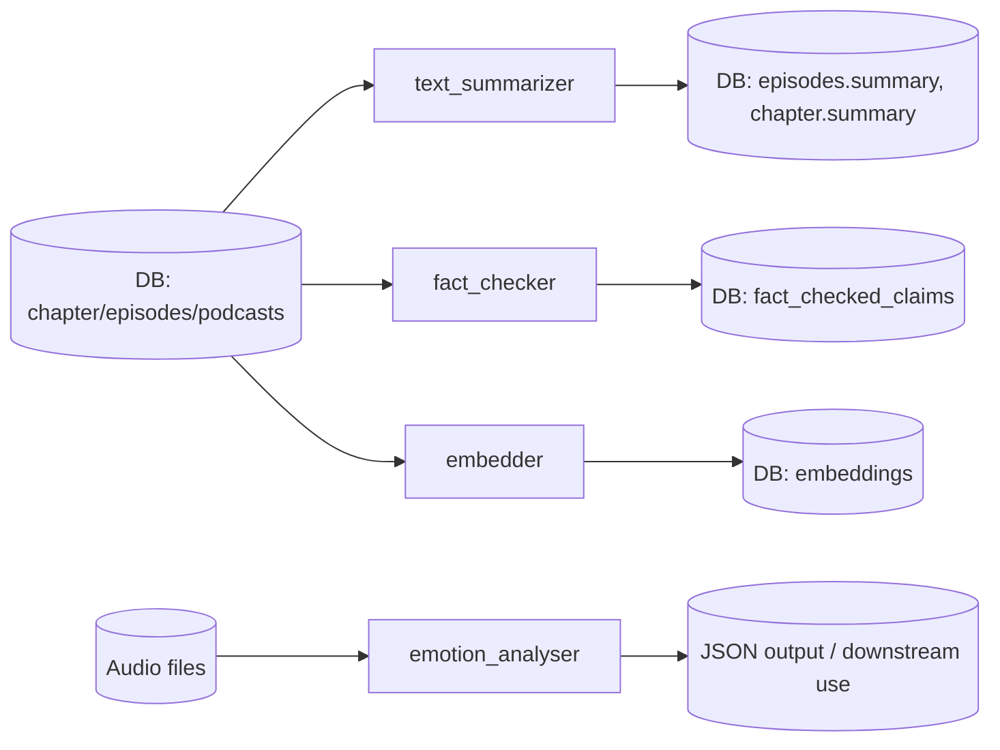
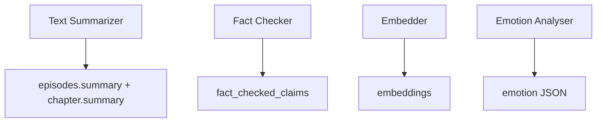
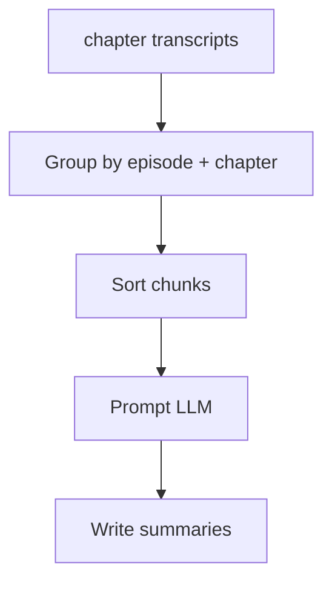
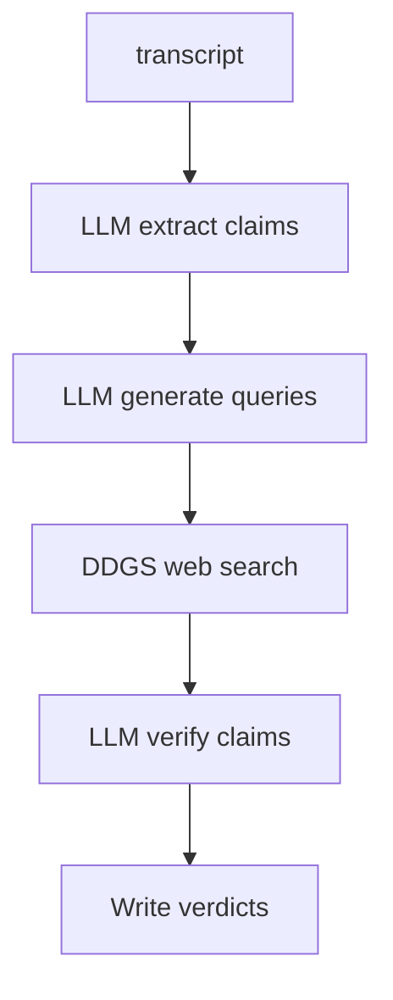
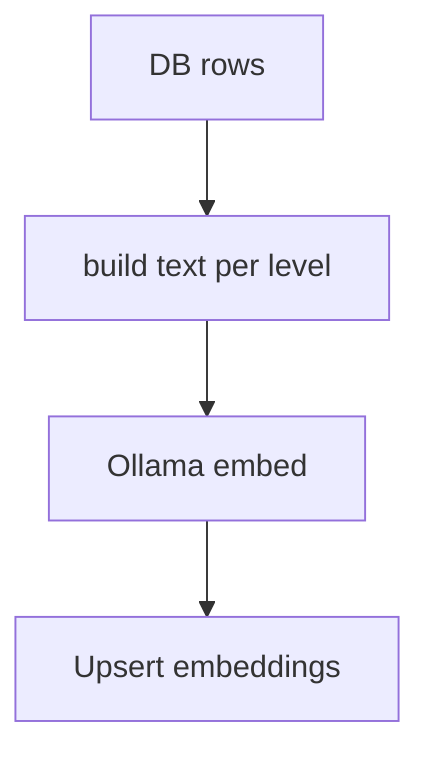
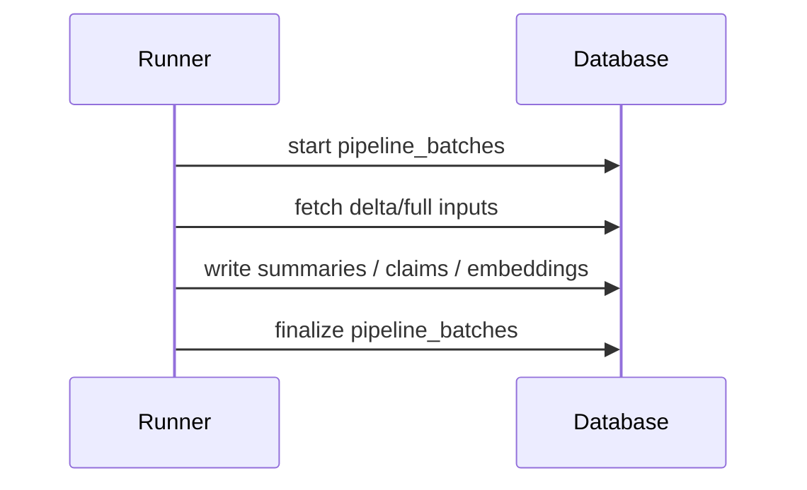

# Silver Enriched: Modules, Inputs/Outputs, Configs

## Purpose (Kurz und praesentationstauglich)

Silver Enriched erzeugt semantische Artefakte aus Podcast-Daten:

- **Summaries** (Episode + Kapitel)
- **Fact-Checking** (Claims + Evidenz + Verdict)
- **Embeddings** (Podcast, Episode, Kapitel)
- **Emotion Scores** (Audio-basiert)

Diese Schicht kombiniert deterministische Datenformung mit LLM-gestuetzten Schritten.

## High-Level Architecture



## Module Overview (Input -> Output)



### 1) Text Summarizer

**Input**

- DB: `chapter.transcript`

**Output**

- DB: `episodes.summary`
- DB: `chapter.summary`

**Flow (vereinfacht)**



**Config (text_summarizer_config.json)**

- `provider` (gemini/ollama)
- `model`, `temperature`
- `logging_enabled`, `log_level`, `log_dir`, `log_file`
- `llm_options`

### 2) Fact Checker

**Input**

- DB: `chapter.transcript`

**Output**

- DB: `fact_checked_claims` (one row per claim)

**Flow (vereinfacht)**



**Config (fact_checker_config.json)**

- `provider` (gemini/ollama)
- `model`, `temperature`
- `region`, `max_queries_per_claim`, `max_search_results_per_query`, `max_sources_per_claim`
- `allowed_verdicts`
- `logging_enabled`, `log_level`, `log_dir`, `log_file`

**Behavior**

- Wenn keine Quellen gefunden werden, wird der Claim als `UNVERIFIABLE` gespeichert.

### 3) Embedder (DB -> embeddings)

**Inputs**

- Podcast-Level: `podcasts.title`
- Episode-Level: `episodes.summary`
- Kapitel-Level: `chapter.transcript`

**Output**

- DB: `embeddings` mit `level` in `podcast | episode | chapter`

**Flow (vereinfacht)**



**Config (transcript_embedder_config.json)**

- `model` (z.B. `qwen3-embedding:4b`)
- `task_instruction`
- `input_text_field` (fallback: `transcript_text`, `transcription`)
- `batch_size`, `max_podcast_sample_size`
- `logging_enabled`, `log_level`, `log_dir`, `log_file`
- `embed_options`

**Hinweis**

- Das Core-Modul laedt die Config standardmaessig aus `transcript_embedder_config.json`.
- DB-Write erfolgt per `ON CONFLICT` (partielle Unique-Indizes auf `embeddings`).

### 4) Emotion Analyser

**Input**

- Audio-Dateien (`.wav`, `.m4a` via ffmpeg)

**Output**

- JSON (Emotion, Confidence, Label)

**Model**

- `superb/wav2vec2-base-superb-er` (Hugging Face)

**Config (emotion_analyser_config.json)**

- `model_id`, `cache_dir`, `sample_rate`, `audio_dir`
- `ffmpeg_binary`, `ffmpeg_audio_channels`, `ffmpeg_audio_rate`
- `logging_enabled`, `log_level`, `log_dir`, `log_file`

## Processing Pipeline (Runner)

Der Runner steuert die Steps: `text_summarizer`, `fact_checker`, `embedder`.



## Delta-Logik (Kurz)

- **Full**: keine Filterung.
- **Delta**: `preprocessing_updated_at > watermark OR processing_updated_at IS NULL`.
- Fact Checker/Embedder nutzen **MAX(processing_updated_at)** der Zieltabellen.

```sql
-- Beispiel (Fact Checker)
SELECT ch.id, MAX(fc.processing_updated_at) AS processing_update_ts
FROM chapter ch
LEFT JOIN fact_checked_claims fc ON fc.chapter_id = ch.id
GROUP BY ch.id
HAVING ch.preprocessing_updated_at > :watermark OR MAX(fc.processing_updated_at) IS NULL
```

## CLI Entry Points

- `emotion_analyser/exec_emotion_analyser.py`
- `fact_checker/exec_fact_checker.py`
- `text_summarizer/exec_text_summarizer.py`
- `transcript_embedder/exec_transcript_embedder.py`
- `processing_pipeline/00_pipeline_processing_runner.py`
