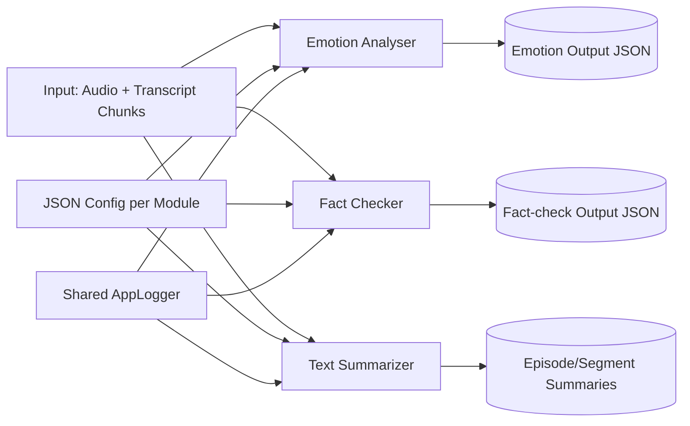
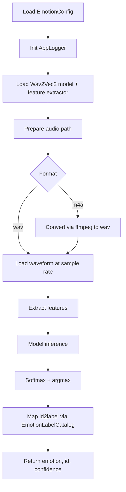
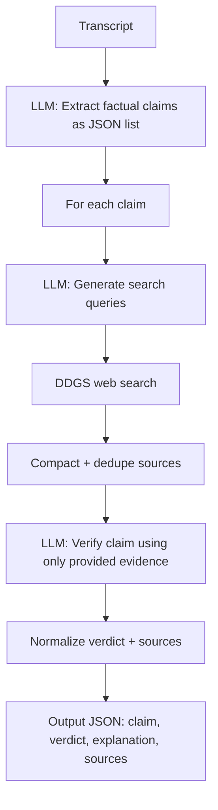
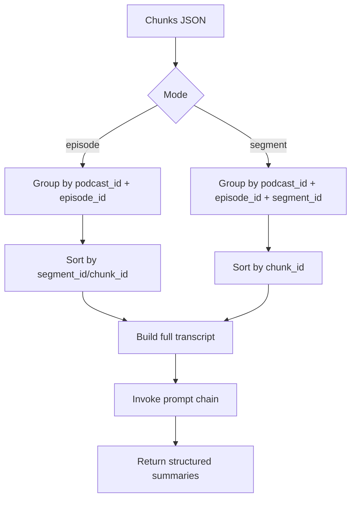

# Silver Enriched Layer: Architecture and Core Concepts

## Purpose

The silver_enriched stage turns intermediate podcast data into higher-value semantic artifacts:

- Emotion labels from audio
- Claim-level fact-check verdicts with evidence links
- Episode and segment summaries

This stage blends deterministic processing (grouping, sorting, parsing) with model-driven reasoning (classification, extraction, summarization, verification).

## Scope in Source Tree

Covered modules in this document:

- src/02_processing/silver_enriched/emotion_analyser
- src/02_processing/silver_enriched/fact_checker
- src/02_processing/silver_enriched/text_summarizer

Shared utility:

- src/02_processing/common/app_logger.py

## High-Level Architecture

## Design Pattern Used Across Modules

All three modules follow the same design approach:

1. Configuration-first setup using a typed dataclass loaded from JSON.
2. A core class that owns the domain logic and external model clients.
3. An executable script for CLI-style local runs and quick validation.
4. Shared logger integration with configurable level, file name, and log directory.

This pattern keeps runtime behavior configurable without code edits and supports both notebooks and script execution.

## Module 1: Emotion Analyser

### What it does

Emotion Analyser classifies speaker emotion from audio clips. It supports wav natively and m4a through ffmpeg conversion.

### Model and tooling

- Hugging Face model: superb/wav2vec2-base-superb-er
- Libraries: transformers, torch, librosa
- Optional conversion dependency: ffmpeg

### Runtime flow

### Key design notes

- Model label mapping is externalized through EmotionLabelCatalog for stable label handling.
- Cache path is configurable so model files can be reused offline.
- Audio pre-processing constraints (sample rate and channel count) are enforced through config.

## Module 2: Fact Checker

### What it does

Fact Checker identifies factual claims in transcripts, gathers web evidence, and returns per-claim verdicts.

### LLM agentic flow concept

This is the most agentic component in silver_enriched. It uses a multi-step orchestration where each step uses a focused prompt and typed post-processing:

1. Claim extraction
2. Query generation per claim
3. Evidence retrieval (DDGS)
4. Claim verification with constrained verdict taxonomy

### Model and tooling

- LLM runtime: ChatOllama
- Default model in config: gemma3:4b
- Search tool: ddgs (DuckDuckGo search client)

### Runtime flow

### Key design notes

- JSON parsing is hardened with fence stripping and fallback behavior.
- Verdicts are normalized against an allowed list to avoid schema drift.
- If evidence is missing, the system deterministically returns UNVERIFIABLE.

## Module 3: Text Summarizer

### What it does

Text Summarizer produces:

- Episode-level summaries
- Segment-level summaries

It operates over chunked transcripts and preserves logical order before prompting.

### Agentic flow concept

This module uses a lighter orchestration than the fact checker:

- Group chunks by episode or segment
- Sort chunks deterministically
- Build transcript context
- Call prompt-specific chain (episode vs segment)

### Model and tooling

- LLM runtime: ChatOllama
- Default model in config: gemma3:4b
- Prompt composition: langchain_core PromptTemplate

### Runtime flow

### Key design notes

- The executor supports filtering by podcast_id, episode_id, and segment_id.
- Output can be printed and optionally saved as JSON.
- Prompt intent is explicit and separated by summarization granularity.

## Configuration Model

Each component has a dedicated JSON config file, loaded into a typed dataclass:

- emotion_analyser/emotion_analyser_config.json
- fact_checker/fact_checker_config.json
- text_summarizer/text_summarizer_config.json

Common config behavior:

- Relative path support from working directory and module directory.
- Optional override support in executor scripts.
- Explicit logging controls.

Typical configurable knobs:

- Model selection (model_id or model)
- Inference controls (for example temperature)
- Search limits and verdict policy (fact checker)
- Audio conversion and sample-rate constraints (emotion analyser)
- Logging enabled, level, file, and log directory

## Logging Strategy

All modules use the shared AppLogger builder:

- Toggle logging per module via config
- Write to console and file when enabled
- Use module-specific log files in configurable directories
- Replace handlers on re-init to avoid duplicate log lines in notebook/script reuse

## Operational Notes

- Emotion analysis depends on local audio files and may require ffmpeg for m4a input.
- Fact checking depends on both local LLM availability and outbound web search.
- Summarization depends on local LLM availability and chunk completeness/order.

## CLI Entry Points

- src/02_processing/silver_enriched/emotion_analyser/exec_emotion_analyser.py
- src/02_processing/silver_enriched/fact_checker/exec_fact_checker.py
- src/02_processing/silver_enriched/text_summarizer/exec_text_summarizer.py

These scripts are intended for manual execution, quick testing, and integration into larger orchestration later.

## Architectural Takeaway

The silver_enriched layer uses a practical hybrid architecture:

- Deterministic data shaping for reliability and reproducibility.
- Modular model wrappers for replaceable AI capabilities.
- Config-driven behavior to decouple code from environment/runtime choices.
- Agentic LLM orchestration where decomposition is needed (especially fact checking).
