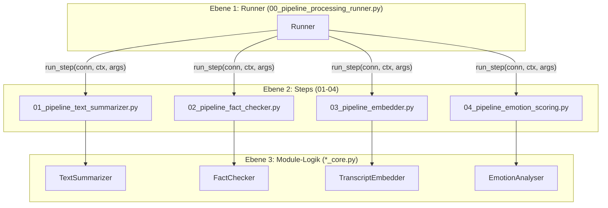
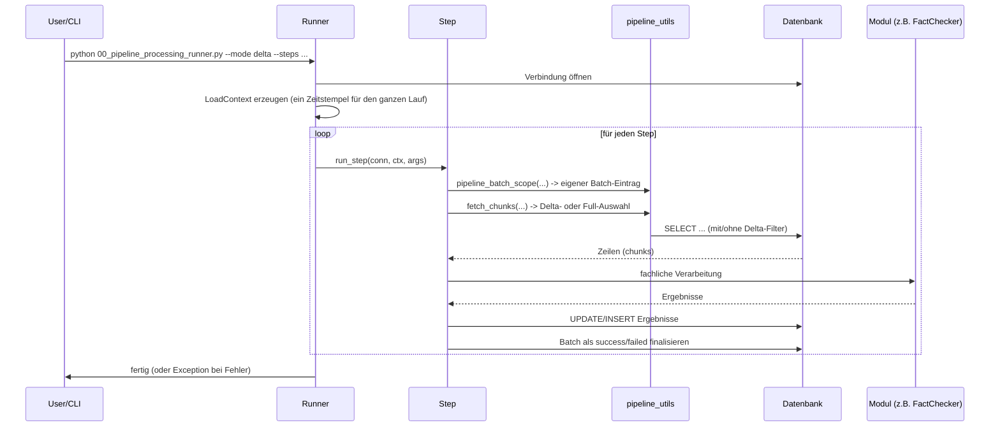

# Architektur & Projektstruktur

## Ordnerstruktur

```text
src/02_processing/
├── common/                          # geteilte Hilfsmittel für ALLE 02_processing-Module
│   ├── app_logger.py                 # zentrale Logger-Fabrik (siehe 05_logging.md)
│   └── db_connector.py               # DB-Verbindung + Timestamp-Parsing
├── sectioning/                       # Vorverarbeitung: Text -> Kapitel
├── transcription/                    # Vorverarbeitung: Audio -> Text
└── silver_enriched/                  # <-- diese Doku
    ├── processing_pipeline/          # Orchestrierung (Runner + Steps)
    │   ├── 00_pipeline_processing_runner.py
    │   ├── 01_pipeline_text_summarizer.py
    │   ├── 02_pipeline_fact_checker.py
    │   ├── 03_pipeline_embedder.py
    │   ├── 04_pipeline_emotion_scoring.py
    │   ├── pipeline_utils.py         # Delta-Logik, Batch-Tracking, Logger-Helper
    │   └── processing_pipeline_config.json
    ├── text_summarizer/               # Modul 1: Zusammenfassungen
    ├── fact_checker/                  # Modul 2: Faktenprüfung
    ├── transcript_embedder/           # Modul 3: Embeddings
    ├── emotion_analyser/               # Modul 4: Emotionserkennung
    ├── pgvector_writer/                # Hilfsklasse zum Schreiben von Vektoren (pgvector)
    └── logs/                           # Log-Dateien aller Module (siehe 05_logging.md)
```

Jedes Modul (`text_summarizer`, `fact_checker`, `transcript_embedder`, `emotion_analyser`) folgt
demselben Aufbau:

| Datei-Muster | Zweck |
|---|---|
| `..._config.json` | Konfigurationswerte (Modell, Provider, Logging, ...) |
| `..._config.py` | Lädt/validiert die JSON-Config in ein Python-Objekt |
| `..._core.py` | Die eigentliche fachliche Logik des Moduls (zustandslos nutzbar) |
| `exec_..._.py` | Eigenständiger CLI-Einstiegspunkt zum manuellen/isolierten Testen |
| `test/` | Beispiel-Inputs/Outputs für lokale Tests |

Diese Trennung erlaubt es, jedes Modul isoliert (über sein `exec_*.py`) oder orchestriert
(über den Runner) auszuführen. Die fachliche Logik in `*_core.py` ist in beiden Fällen identisch.

## Die zwei Ebenen der Orchestrierung



1. **Runner** (`00_pipeline_processing_runner.py`)
   - Einstiegspunkt für einen kompletten Lauf.
   - Parst CLI-Argumente (ggf. überschrieben durch `processing_pipeline_config.json`).
   - Baut einen gemeinsamen Logger und eine Datenbank-Verbindung auf.
   - Erzeugt einen `LoadContext` (Modus, Connector, gemeinsamer Zeitstempel, Logger, Dry-Run-Flag),
     der an jeden Step weitergegeben wird.
   - Lädt die gewünschten Step-Module dynamisch (`importlib`) und ruft pro Step `run_step(conn, ctx, args)` auf.
   - Bei Fehlern: Rollback der Transaktion, danach wird die Exception erneut geworfen (kein "silent fail").

2. **Steps** (`01_..._text_summarizer.py`, `02_..._fact_checker.py`, `03_..._embedder.py`, `04_..._emotion_scoring.py`)
   - Jeder Step kann auch eigenständig ausgeführt werden (eigene `main()`-Funktion + eigene CLI-Argumente).
   - Verantwortlich für: Daten aus der DB holen (`fetch_chunks`), das fachliche Modul aufrufen,
     Ergebnisse zurück in die DB schreiben, eigenen Eintrag in `pipeline_batches` verwalten.
   - Jeder Step entscheidet selbst, was im Delta-Modus als "neu" gilt (siehe [02_load_strategy.md](02_load_strategy.md)).

3. **Module-Kern** (`*_core.py`)
   - Reine fachliche Logik (LLM-Aufruf, Embedding-Berechnung, Audio-Analyse, ...).
   - Kennt die Datenbank nicht, sondern bekommt fertige Text-/Audio-Inputs und liefert Ergebnisse zurück.

## Ein Lauf von oben nach unten (Sequenzdiagramm)



## Warum diese Architektur?

- **Wiederverwendbarkeit**: Jeder Step lässt sich isoliert testen oder in Produktion separat
  anstoßen (z. B. nur `fact_checker` neu laufen lassen).
- **Robustheit**: Jeder Step verwaltet seinen eigenen `pipeline_batches`-Eintrag. Ein
  fehlgeschlagener Step blockiert nicht automatisch die anderen, wenn man sie getrennt aufruft.
- **Konsistenz im Runner-Lauf**: Der Runner erzeugt einen Zeitstempel (`processing_update_ts`)
  zu Beginn, der für alle Schreibvorgänge dieses Laufs verwendet wird. So haben alle in einem
  Lauf bearbeiteten Zeilen denselben Verarbeitungszeitpunkt.

## CLI-Einstiegspunkte (Übersicht)

| Datei | Zweck |
|---|---|
| `processing_pipeline/00_pipeline_processing_runner.py` | Orchestriert beliebige Kombination von Steps |
| `processing_pipeline/01_pipeline_text_summarizer.py` | Nur Text Summarizer (auch einzeln aufrufbar) |
| `processing_pipeline/02_pipeline_fact_checker.py` | Nur Fact Checker (auch einzeln aufrufbar) |
| `processing_pipeline/03_pipeline_embedder.py` | Nur Embedder (auch einzeln aufrufbar) |
| `processing_pipeline/04_pipeline_emotion_scoring.py` | Nur Emotion Scoring (auch einzeln aufrufbar) |
| `text_summarizer/exec_text_summarizer.py` | Modul isoliert testen, ohne DB (Datei-Input/Output) |
| `fact_checker/exec_fact_checker.py` | Modul isoliert testen, ohne DB |
| `transcript_embedder/exec_transcript_embedder.py` | Modul isoliert testen, ohne DB |
| `emotion_analyser/exec_emotion_analyser.py` | Modul isoliert testen, ohne DB |
