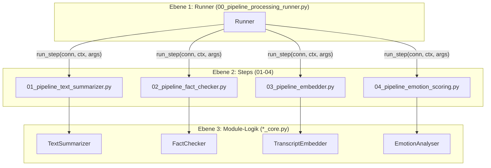
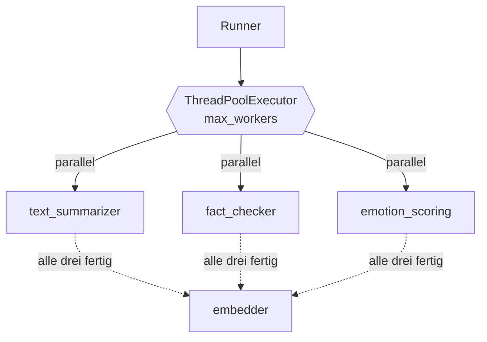
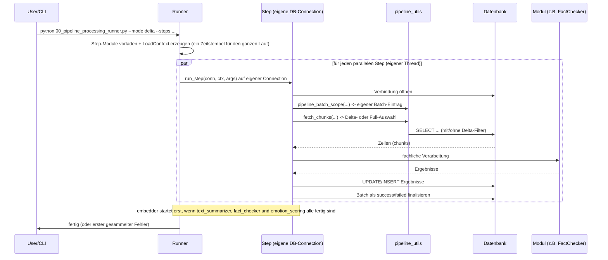

# Architektur & Projektstruktur

## Ordnerstruktur

```text
src/02_processing/
├── common/                          # geteilte Hilfsmittel für ALLE 02_processing-Module
│   ├── app_logger.py                 # zentrale Logger-Fabrik (siehe 05_logging.md)
│   └── db_connector.py               # DB-Verbindung + Timestamp-Parsing
├── sectioning/                       # Vorverarbeitung: Text -> Kapitel
├── transcription/                    # Vorverarbeitung: Audio -> Text
└── silver_enriched/                  # <-- diese Doku
    ├── processing_pipeline/          # Orchestrierung (Runner + Steps)
    │   ├── 00_pipeline_processing_runner.py
    │   ├── 01_pipeline_text_summarizer.py
    │   ├── 02_pipeline_fact_checker.py
    │   ├── 03_pipeline_embedder.py
    │   ├── 04_pipeline_emotion_scoring.py
    │   ├── pipeline_utils.py         # Delta-Logik, Batch-Tracking, Logger-Helper
    │   └── processing_pipeline_config.json
    ├── text_summarizer/               # Modul 1: Zusammenfassungen
    ├── fact_checker/                  # Modul 2: Faktenprüfung
    ├── transcript_embedder/           # Modul 3: Embeddings
    ├── emotion_analyser/               # Modul 4: Emotionserkennung
    ├── pgvector_writer/                # Hilfsklasse zum Schreiben von Vektoren (pgvector)
    └── logs/                           # Log-Dateien aller Module (siehe 05_logging.md)
```

Jedes Modul (`text_summarizer`, `fact_checker`, `transcript_embedder`, `emotion_analyser`) folgt
demselben Aufbau:

| Datei-Muster | Zweck |
|---|---|
| `..._config.json` | Konfigurationswerte (Modell, Provider, Logging, ...) |
| `..._config.py` | Lädt/validiert die JSON-Config in ein Python-Objekt |
| `..._core.py` | Die eigentliche fachliche Logik des Moduls (zustandslos nutzbar) |
| `exec_..._.py` | Eigenständiger CLI-Einstiegspunkt zum manuellen/isolierten Testen |
| `test/` | Beispiel-Inputs/Outputs für lokale Tests |

Diese Trennung erlaubt es, jedes Modul isoliert (über sein `exec_*.py`) oder orchestriert
(über den Runner) auszuführen. Die fachliche Logik in `*_core.py` ist in beiden Fällen identisch.

## Die zwei Ebenen der Orchestrierung



1. **Runner** (`00_pipeline_processing_runner.py`)
   - Einstiegspunkt für einen kompletten Lauf.
   - Parst CLI-Argumente (ggf. überschrieben durch `processing_pipeline_config.json`).
   - Baut einen gemeinsamen Logger auf und erzeugt einen `LoadContext` (Modus, Connector,
     gemeinsamer Zeitstempel, Logger, Dry-Run-Flag), der an jeden Step weitergegeben wird.
   - Lädt die gewünschten Step-Module vorab im Hauptthread (`importlib`), damit die Importe nicht
     nebenläufig laufen.
   - Führt die Steps **parallel** über einen `ThreadPoolExecutor` aus (siehe
     [Parallele Ausführung der Steps](#parallele-ausführung-der-steps)). Jeder Step bekommt seine
     **eigene Datenbank-Verbindung** (`run_step(conn, ctx, args)`), da psycopg-Connections nicht
     thread-sicher geteilt werden können.
   - Bei Fehlern: Der Step rollt seine eigene Transaktion zurück; der Runner sammelt die Fehler
     aller Steps und wirft danach den ersten erneut (kein "silent fail").

2. **Steps** (`01_..._text_summarizer.py`, `02_..._fact_checker.py`, `03_..._embedder.py`, `04_..._emotion_scoring.py`)
   - Jeder Step kann auch eigenständig ausgeführt werden (eigene `main()`-Funktion + eigene CLI-Argumente).
   - Verantwortlich für: Daten aus der DB holen (`fetch_chunks`), das fachliche Modul aufrufen,
     Ergebnisse zurück in die DB schreiben, eigenen Eintrag in `pipeline_batches` verwalten.
   - Jeder Step entscheidet selbst, was im Delta-Modus als "neu" gilt (siehe [02_load_strategy.md](02_load_strategy.md)).

3. **Module-Kern** (`*_core.py`)
   - Reine fachliche Logik (LLM-Aufruf, Embedding-Berechnung, Audio-Analyse, ...).
   - Kennt die Datenbank nicht, sondern bekommt fertige Text-/Audio-Inputs und liefert Ergebnisse zurück.

## Parallele Ausführung der Steps

Der Runner führt die Steps nicht mehr streng nacheinander aus, sondern über einen
`ThreadPoolExecutor`. Hintergrund: `text_summarizer`, `fact_checker` und `emotion_scoring` lesen
verschiedene Quelltabellen und schreiben verschiedene Zieltabellen, es gibt also keinen
Datenkonflikt. Zusätzlich ist `emotion_scoring` CPU/GPU-lastig (Wav2Vec2 + ffmpeg), die anderen
beiden sind I/O-lastig (HTTP zu LLM/Web). Sie belasten unterschiedliche Ressourcen und überlappen
sich daher gut.



- **Parallel-Gruppe:** `text_summarizer`, `fact_checker`, `emotion_scoring` (Konstante
  `PARALLEL_STEPS` im Runner).
- **Abhängigkeit:** `embedder` braucht `episodes.summary` (von `text_summarizer`), startet aber
  bewusst erst, wenn **alle drei** Steps der Parallel-Gruppe fertig sind — nicht nur
  `text_summarizer`. Grund: `embedder` ruft Ollama (lokales Embedding-Modell) auf, das einen
  eigenen Speicherblock braucht. Läuft er gleichzeitig mit `emotion_scoring` (lädt ein
  Torch-Modell) und `fact_checker` (mehrere LLM-/Such-Threads), kann der Hauptspeicher knapp
  werden und Ollamas `llama-server` mit einem Out-of-Memory-Fehler abbrechen. Indem `embedder`
  wartet, bis die anderen drei ihren Speicher wieder freigegeben haben, läuft er praktisch
  konkurrenzlos. Ist `text_summarizer` nicht Teil des Laufs, startet `embedder` sofort, sobald die
  übrigen Steps fertig sind. Schlägt `text_summarizer` fehl, wird `embedder` übersprungen
  (die anderen Steps dürfen trotzdem fehlschlagen, ohne `embedder` zu blockieren).
- **Eigene Connection pro Step:** Jeder Step öffnet über den `DbConnector` seine eigene
  Verbindung und verwaltet seine eigene Transaktion. Der gemeinsame `LoadContext` (inkl.
  Zeitstempel und Logger) wird nur lesend geteilt; `args` wird pro Step kopiert (`copy.copy`),
  damit das `stage`-Feld nicht zwischen Threads kollidiert.
- **Worker-Zahl (`--max-workers` / `max_workers` in `processing_pipeline_config.json`):**
  - Standard (`null`): automatisch so groß wie die Anzahl paralleler Steps (plus ein Slot für
    `embedder`).
  - Explizit gesetzt (z. B. `1`): begrenzt, wie viele Steps wirklich gleichzeitig laufen dürfen —
    nützlich, wenn der Rechner bei voller Parallelität an Speichergrenzen stößt (z. B. wiederholte
    Ollama-OOM-Fehler). `1` serialisiert alle Steps vollständig.

> Hinweis: Innerhalb des `fact_checker` gibt es eine **zweite** Parallelisierungsebene — die
> einzelnen Claims werden ebenfalls über einen Thread-Pool abgearbeitet
> (siehe [04_modules.md](04_modules.md)).

## Ein Lauf von oben nach unten (Sequenzdiagramm)



## Warum diese Architektur?

- **Wiederverwendbarkeit**: Jeder Step lässt sich isoliert testen oder in Produktion separat
  anstoßen (z. B. nur `fact_checker` neu laufen lassen).
- **Robustheit**: Jeder Step verwaltet seinen eigenen `pipeline_batches`-Eintrag. Ein
  fehlgeschlagener Step blockiert nicht automatisch die anderen, wenn man sie getrennt aufruft.
- **Konsistenz im Runner-Lauf**: Der Runner holt zu Beginn einmalig `SELECT NOW()` aus der
  Datenbank (`fetch_db_now`, nicht die App-Uhr) und nutzt diesen einen Zeitstempel
  (`processing_update_ts`) für alle Schreibvorgänge dieses Laufs. So haben alle in einem Lauf
  bearbeiteten Zeilen denselben Verarbeitungszeitpunkt — auch über parallele Steps hinweg — und es
  gibt keine Uhren-Drift zwischen App-Server und DB (siehe [02_load_strategy.md](02_load_strategy.md)).
- **Parallelität ohne geteilten Zustand**: Weil jeder Step eine eigene DB-Connection und eine
  eigene Transaktion hat und auf disjunkte Tabellen schreibt, lassen sich die Steps gefahrlos
  parallel ausführen. Der gemeinsame `LoadContext` wird nur lesend geteilt.

## CLI-Einstiegspunkte (Übersicht)

| Datei | Zweck |
|---|---|
| `processing_pipeline/00_pipeline_processing_runner.py` | Orchestriert beliebige Kombination von Steps |
| `processing_pipeline/01_pipeline_text_summarizer.py` | Nur Text Summarizer (auch einzeln aufrufbar) |
| `processing_pipeline/02_pipeline_fact_checker.py` | Nur Fact Checker (auch einzeln aufrufbar) |
| `processing_pipeline/03_pipeline_embedder.py` | Nur Embedder (auch einzeln aufrufbar) |
| `processing_pipeline/04_pipeline_emotion_scoring.py` | Nur Emotion Scoring (auch einzeln aufrufbar) |
| `text_summarizer/exec_text_summarizer.py` | Modul isoliert testen, ohne DB (Datei-Input/Output) |
| `fact_checker/exec_fact_checker.py` | Modul isoliert testen, ohne DB |
| `transcript_embedder/exec_transcript_embedder.py` | Modul isoliert testen, ohne DB |
| `emotion_analyser/exec_emotion_analyser.py` | Modul isoliert testen, ohne DB |
