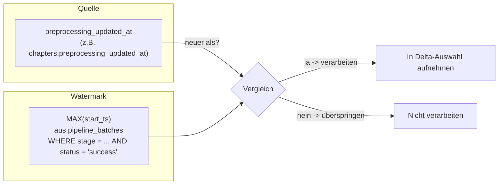
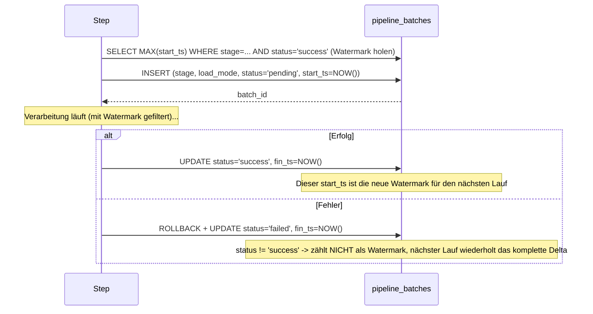
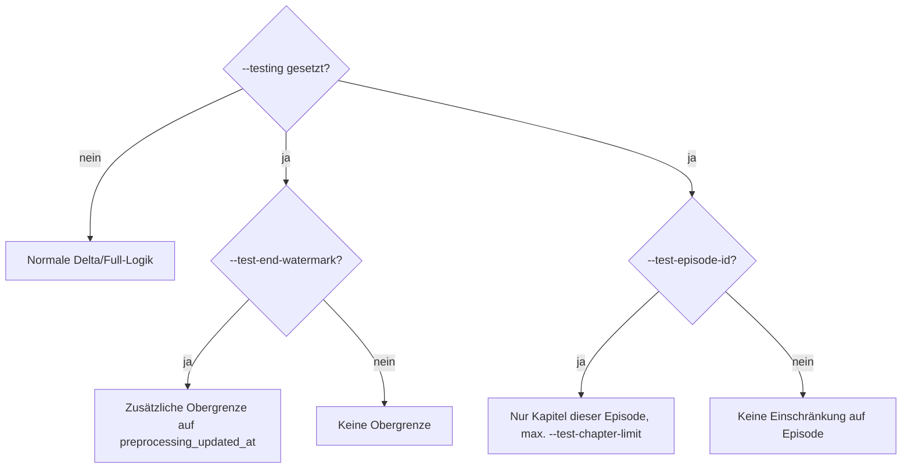

# Full- und Delta-Load: Wie wird entschieden, was verarbeitet wird?

## Glossar: Grundbegriffe der Datenladestrategie

| Begriff                              | Erklärung                                                                                                                                                                                                |
| ------------------------------------ | -------------------------------------------------------------------------------------------------------------------------------------------------------------------------------------------------------- |
| **Full Load**                        | Alles wird neu verarbeitet, ohne zu prüfen, ob ein Datensatz schon bearbeitet wurde. Einfach, aber teuer bei großen Datenmengen.                                                                         |
| **Delta Load**                       | Es wird nur verarbeitet, was seit dem letzten erfolgreichen Lauf neu oder verändert ist. Spart LLM-/Such-/Audio-Aufrufe.                                                                                 |
| **Watermark**                        | Ein Zeitstempel, der als Marke dient: "Alles bis hier wurde schon verarbeitet."                                                                                                                          |
| **Stage-Watermark (hier verwendet)** | Statt eines Wertes pro Zeile/Kapitel wird **ein einziger Zeitstempel pro Step** genommen: der `start_ts` des letzten erfolgreichen Laufs dieses Steps aus `pipeline_batches`.                            |
| **`preprocessing_updated_at`**       | Wann wurde ein Datensatz zuletzt durch die Vorverarbeitung (Transkription/Sectioning) verändert? Sitzt auf den Quelltabellen (`chapters`, `episodes`, `podcasts`, `transcript_lines`).                   |
| **`pipeline_batches`**               | Ein Eintrag pro Lauf eines Steps: `stage`, `load_mode`, `status`, `start_ts`, `fin_ts`. Ist jetzt nicht mehr nur Beobachtbarkeit, sondern **die Quelle der Delta-Watermark**.                            |
| **Run-scoped Timestamp**             | Zu Laufbeginn fragt der Runner einmalig `SELECT NOW()` bei der Datenbank ab (`processing_update_ts`). Dieser eine Wert wird für **alle** Schreibvorgänge dieses Laufs verwendet, über alle Steps hinweg. |
| **Dry Run**                          | Lauf ohne tatsächliche Datenbank-Schreibvorgänge; legt auch keinen `pipeline_batches`-Eintrag an, rückt also die Watermark nicht vor.                                                                    |

## Warum ein Stage-Watermark statt eines Pro-Zeile-Vergleichs?

**Altes Problem:** Frühere Versionen verglichen `preprocessing_updated_at` (Quelle) direkt mit
`MAX(processing_updated_at)` (Ziel) pro Kapitel/Zeile. Das brach bei Kapiteln, die **legitim keine
Zeile im Ziel erzeugen**, also z. B. ein Kapitel ohne überprüfbare Behauptungen bei `fact_checker`.
Ohne Zielzeile bleibt `MAX(...)` immer `NULL`, also wurde das Kapitel bei **jedem** Delta-Lauf erneut
verarbeitet, obwohl es bereits (mit dem korrekten Ergebnis "keine Claims") bearbeitet wurde.

**Lösung:** Statt mit dem Ziel zu vergleichen, vergleicht jeder Step seine Quelle nur noch mit
**dem Zeitpunkt, an dem er selbst zuletzt erfolgreich gelaufen ist**. Dabei spielt keine Rolle, ob
dabei Zeilen geschrieben wurden oder nicht.



## Die Kernregel (gilt für jeden Step, jede Ebene)

```sql
-- Pseudocode der Delta-Bedingung
WHERE preprocessing_updated_at > (
    SELECT MAX(start_ts) FROM pipeline_batches
    WHERE stage = '<dieser step>' AND status = 'success'
)
-- oder: kein erfolgreicher Lauf bisher -> Watermark ist NULL -> alles verarbeiten
```

### Warum `start_ts` und nicht `fin_ts`?

- `start_ts` = Zeitpunkt, an dem der Step **mit dem Lesen** begonnen hat.
- `fin_ts` = Zeitpunkt, an dem der Step **fertig** war.
- Wird zwischen Start und Ende eines Laufs ein Datensatz neu vorverarbeitet
  (`preprocessing_updated_at` aktualisiert sich), würde ein Watermark auf Basis von `fin_ts`
  diesen Datensatz **fälschlich als "schon erledigt" markieren**, obwohl er gar nicht gelesen wurde.
- Mit `start_ts` als Watermark wird ein solcher Datensatz beim **nächsten** Lauf einfach erneut
  aufgenommen. Das kostet im schlimmsten Fall eine zusätzliche, harmlose Wiederholung
  (idempotent durch `ON CONFLICT ... DO UPDATE`). Datenverlust ist damit ausgeschlossen.

## Welcher Step vergleicht mit welcher Watermark?

| Step                        | Quelle (`preprocessing_updated_at`)         | Watermark (`pipeline_batches.stage`) |
| --------------------------- | ------------------------------------------- | ------------------------------------ |
| `text_summarizer`           | `chapters.preprocessing_updated_at`         | `stage = 'text_summarizer'`          |
| `fact_checker`              | `chapters.preprocessing_updated_at`         | `stage = 'fact_checker'`             |
| `embedder` (Kapitel-Ebene)  | `chapters.preprocessing_updated_at`         | `stage = 'embedder'`                 |
| `embedder` (Episoden-Ebene) | `episodes.preprocessing_updated_at`         | `stage = 'embedder'`                 |
| `embedder` (Podcast-Ebene)  | `podcasts.preprocessing_updated_at`         | `stage = 'embedder'`                 |
| `emotion_scoring`           | `transcript_lines.preprocessing_updated_at` | `stage = 'emotion_scoring'`          |

> Alle drei Embedding-Ebenen teilen sich **eine** Watermark (`stage = 'embedder'`), weil sie im
> selben Lauf gemeinsam als ein Batch-Eintrag laufen.

## Run-scoped Timestamp: woher kommt `processing_updated_at`?

- Früher: `datetime.now(timezone.utc)` in Python. Das birgt das Risiko von **Uhren-Drift** zwischen
  App-Server und Datenbank, wenn dieser Wert später in SQL mit DB-eigenen Zeitstempeln verglichen wird.
- Jetzt: `fetch_db_now(conn)` führt `SELECT NOW()` aus. Der Zeitstempel kommt **direkt aus der
  DB-Uhr**, also derselben Uhr, die auch `start_ts`/`fin_ts` in `pipeline_batches` schreibt.
- Wird **einmal pro Lauf** geholt (im Runner, bzw. einmal pro eigenständigem Step-Aufruf) und an
  alle Schreibvorgänge dieses Laufs weitergegeben. Alle Zeilen eines Laufs tragen also denselben
  `processing_updated_at`, auch über parallele Steps hinweg.

## Full-Load im Detail

- Modus `--mode full`.
- Keine Delta-Bedingung in der Abfrage. Alle (ggf. durch Testfilter eingeschränkten) Datensätze
  werden verarbeitet, unabhängig von der Watermark.
- Sinnvoll für: Erstbefüllung, große Reprozessierungen (z. B. nach Modell- oder Prompt-Wechsel).

## Delta-Load im Detail

- Modus `--mode delta` (Standard).
- Jeder Step holt sich vor der Abfrage seine eigene Stage-Watermark (`fetch_stage_watermark`).
- Kein erfolgreicher Lauf bisher → Watermark ist `NULL` → Delta-Lauf verhält sich wie Full-Load.
- Wiederholte Läufe sind idempotent und günstig: Kapitel/Zeilen, die seit dem letzten
  erfolgreichen Lauf nicht mehr verändert wurden, werden **nicht** erneut durch teure
  LLM-/Embedding-/Audio-Aufrufe geschickt. Das gilt **auch, wenn sie keine Zielzeile erzeugt haben**
  (z. B. ein Kapitel ohne Claims).

## Batch-Tracking (`pipeline_batches`): jetzt Steuerung **und** Beobachtbarkeit



- `stage`: Name des Steps (`text_summarizer`, `fact_checker`, `embedder`, `emotion_scoring`).
- `load_mode`: `full` oder `delta`.
- `status`: `pending` → `success` oder `failed`. Nur `success`-Einträge zählen als Watermark.
- Jeder Step schreibt **alle** seine Ergebnisse in einem einzigen `executemany` und einem finalen
  `conn.commit()` (kein schrittweises Speichern). Schlägt ein Lauf fehl, gibt es daher ohnehin
  keine "teilweise erledigten" Daten zu schützen. Die Stage-Watermark-Strategie verliert dadurch
  nichts gegenüber der alten Pro-Zeile-Logik.
- Wird `--batch-id` explizit übergeben, nutzt der Step diesen Batch nur, um die geschriebenen
  Zeilen zu markieren. Er legt dann **keinen eigenen** Batch-Eintrag an und rückt die Watermark
  dadurch **nicht** vor. Das macht der Aufrufer.
- `--dry-run` legt ebenfalls keinen Batch-Eintrag an und rückt die Watermark nicht vor.

## Testmodi (nur mit `--testing`)

| Parameter                                    | Wirkung                                                                                                                                      |
| -------------------------------------------- | -------------------------------------------------------------------------------------------------------------------------------------------- |
| `--test-end-watermark`                       | Zusätzliche Obergrenze auf `preprocessing_updated_at` (simuliert "als ob es jetzt dieser Zeitpunkt wäre"). Gilt nicht für `emotion_scoring`. |
| `--test-episode-id` + `--test-chapter-limit` | Beschränkt die Verarbeitung auf eine einzelne Episode und maximal N Kapitel.                                                                 |



## Zusammenfassung

- Watermark = `MAX(start_ts)` des letzten **erfolgreichen** Laufs desselben Steps aus
  `pipeline_batches`, nicht mehr ein Vergleich gegen das Ziel.
- Löst das "Kapitel ohne Claims wird ewig wiederholt"-Problem, weil die Watermark nicht davon
  abhängt, ob überhaupt eine Zielzeile geschrieben wurde.
- `start_ts` statt `fin_ts`, damit keine während des Laufs aktualisierten Datensätze verloren gehen.
- `processing_updated_at` kommt aus `SELECT NOW()` (DB-Uhr), einmal pro Lauf, geteilt über alle
  Steps und Zeilen dieses Laufs.
- Nur `status='success'`-Batches zählen als Watermark. Fehlgeschlagene, Dry-Run- und
  `--batch-id`-Läufe rücken sie nicht vor.
- Testparameter erlauben kontrolliertes, kostengünstiges Ausprobieren ohne den
  Produktionsdatenbestand komplett anzufassen.
