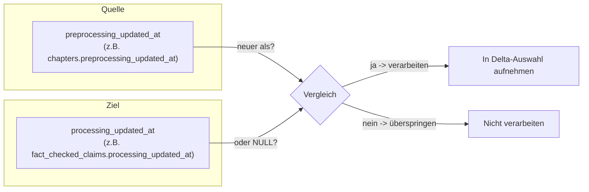
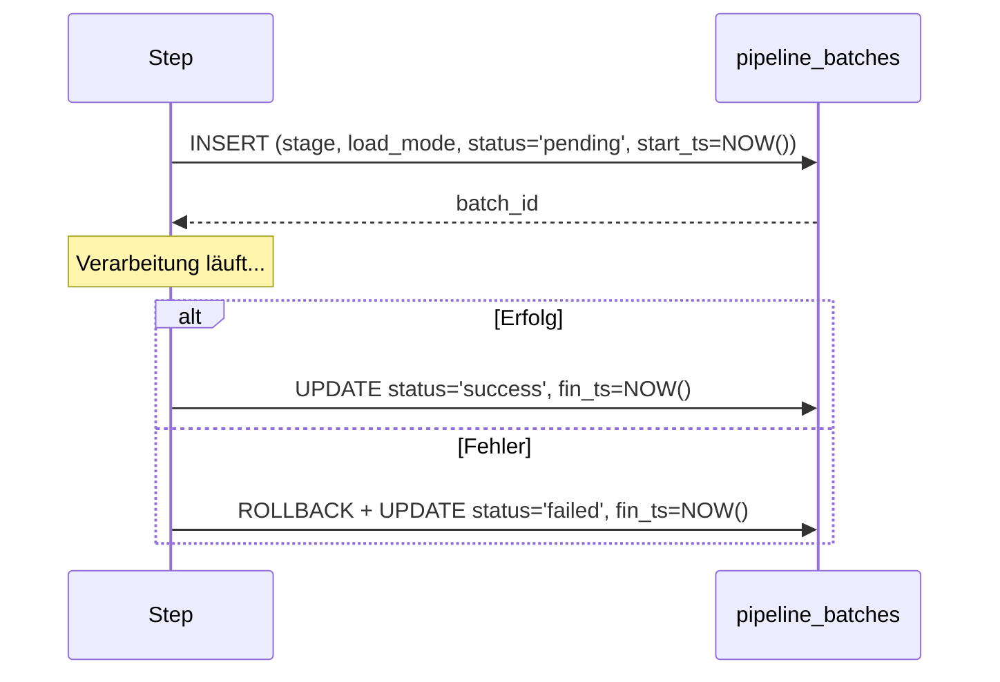
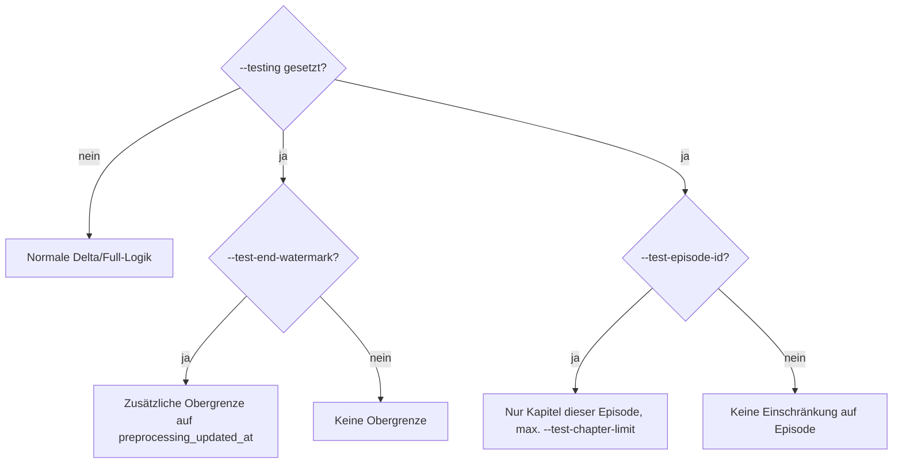

# Full- und Delta-Load: Wie wird entschieden, was verarbeitet wird?

## Glossar: Grundbegriffe der Datenladestrategie

Bevor es um Details geht, hier die wichtigsten Fachbegriffe:

| Begriff | Erklärung |
|---|---|
| **Full Load** | Alles wird neu verarbeitet. Es wird nicht geprüft, ob ein Datensatz schon bearbeitet wurde, jeder passende Datensatz läuft erneut durch. Einfach, aber teuer bei großen Datenmengen. |
| **Delta Load** | Es wird nur verarbeitet, was neu oder verändert ist. Spart Zeit und Kosten (z. B. LLM-Aufrufe), weil bereits verarbeitete, unveränderte Datensätze übersprungen werden. |
| **Watermark** | Ein Zeitstempel (oder Wert), der als Marke dient: "Alles bis hier wurde schon verarbeitet." Ein neuer Lauf verarbeitet nur, was über dieser Marke liegt. |
| **Globaler Watermark** | Ein einziger Watermark-Wert für die gesamte Pipeline. Wird hier nicht verwendet, siehe unten. |
| **Pro-Step-Watermark (hier verwendet)** | Statt eines globalen Wertes vergleicht jeder Step selbst zwei Zeitstempel aus seiner eigenen Quelle und seinem eigenen Ziel, um zu erkennen, ob ein Datensatz neu verarbeitet werden muss. |
| **`preprocessing_updated_at`** | Zeitstempel: Wann wurde dieser Datensatz zuletzt durch die Vorverarbeitung (Transkription/Sectioning) verändert? Sitzt auf den Quelltabellen (`chapters`, `episodes`, `podcasts`, `transcript_lines`). |
| **`processing_updated_at`** | Zeitstempel: Wann wurde dieser Datensatz zuletzt durch die Anreicherung (Silver Enriched) verarbeitet? Sitzt auf den Zieltabellen/-spalten (z. B. `fact_checked_claims.processing_updated_at`, `embeddings.processing_updated_at`). |
| **Batch (`pipeline_batches`)** | Ein Eintrag pro Lauf eines Steps: Start-/Endzeit, Modus (full/delta), Status (pending/success/failed). Dient nur der Nachvollziehbarkeit/Protokollierung, nicht der Steuerung der Delta-Logik. |
| **Run-scoped Timestamp** | Der Runner erzeugt einen Zeitstempel zu Laufbeginn (`processing_update_ts`). Alle Schreibvorgänge dieses Laufs, egal welcher Step, bekommen denselben Wert. Dadurch lässt sich später leicht erkennen, was zu diesem einen Lauf gehörte. |
| **Dry Run** | Lauf ohne tatsächliche Datenbank-Schreibvorgänge, nützlich zum Testen, was verarbeitet würde. |

## Warum kein globaler Watermark?

In früheren Versionen gab es einen zentralen, globalen Watermark in `pipeline_batches`. Das Problem:
Module laufen unterschiedlich oft und unterschiedlich schnell (z. B. Embeddings deutlich öfter als
Fact-Checking). Ein globaler Wert hätte entweder zu oft "alles" oder fälschlich "nichts" markiert.

Die Lösung: Jeder Step vergleicht direkt seine eigene Quelle mit seinem eigenen Ziel.



## Die Kernregel (gilt für jeden Step)

```sql
-- Pseudocode der Delta-Bedingung
WHERE preprocessing_updated_at > processing_updated_at
   OR processing_updated_at IS NULL
```

Auf Deutsch: Nimm den Datensatz, wenn die Vorverarbeitung neuer ist als die letzte Anreicherung,
oder wenn er noch nie angereichert wurde.

Da manche Ziele (z. B. `fact_checked_claims`, `embeddings`) mehrere Zeilen pro Quell-Datensatz
haben können (mehrere Claims pro Kapitel, mehrere Embedding-Level), wird dort statt eines einzelnen
Zeitstempels das Maximum verwendet:

```sql
-- Beispiel: Fact Checker
SELECT ch.id, MAX(fc.processing_updated_at) AS processing_update_ts
FROM chapters ch
LEFT JOIN fact_checked_claims fc ON fc.chapter_id = ch.id
GROUP BY ch.id
HAVING ch.preprocessing_updated_at > MAX(fc.processing_updated_at)
    OR MAX(fc.processing_updated_at) IS NULL
```

> Technischer Hinweis: Aggregat-Ausdrücke (`MAX(...)`) dürfen in SQL nicht in `WHERE` stehen,
> deshalb wandert die Bedingung dort in `HAVING` (siehe `pipeline_utils._build_fetch_spec`).

## Welcher Step vergleicht mit welcher Zieltabelle?

| Step | Quelle (`preprocessing_updated_at`) | Ziel (`processing_updated_at`) |
|---|---|---|
| `text_summarizer` | `chapters.preprocessing_updated_at` | `chapters.processing_updated_at` |
| `fact_checker` | `chapters.preprocessing_updated_at` | `MAX(fact_checked_claims.processing_updated_at)` je Kapitel |
| `embedder` (Kapitel-Ebene) | `chapters.preprocessing_updated_at` | `MAX(embeddings.processing_updated_at)` mit `level='chapter'` |
| `embedder` (Episoden-Ebene) | `episodes.preprocessing_updated_at` | `MAX(embeddings.processing_updated_at)` mit `level='episode'` |
| `embedder` (Podcast-Ebene) | `podcasts.preprocessing_updated_at` | `MAX(embeddings.processing_updated_at)` mit `level='podcast'` |
| `emotion_scoring` | `transcript_lines.preprocessing_updated_at` | `transcript_lines.processing_updated_at` |

## Full-Load im Detail

- Modus `--mode full`.
- Es wird keine Delta-Bedingung an die Abfrage angehängt, also werden alle (ggf. durch Testfilter
  eingeschränkten) Datensätze verarbeitet.
- Sinnvoll für: Erstbefüllung, große Reprozessierungen (z. B. nach Modell- oder Prompt-Wechsel).

## Delta-Load im Detail

- Modus `--mode delta` (Standard).
- Pro Step wird die Kernregel von oben angewendet.
- Vorteil: Wiederholte Läufe sind idempotent und günstig, bereits aktuelle Datensätze werden
  nicht erneut durch teure LLM-/Embedding-/Audio-Aufrufe geschickt.

## Batch-Tracking (`pipeline_batches`): nur Dokumentation, keine Steuerung



- `stage`: Name des Steps (`text_summarizer`, `fact_checker`, `embedder`, `emotion_scoring`),
  technisch begrenzt durch das DB-Enum `pipeline_stage` (`ingestion`/`transcription`/`segmenting`/`processing`).
- `load_mode`: `full` oder `delta`.
- `status`: `pending` → `success` oder `failed`.
- Wird `--batch-id` explizit übergeben, übernimmt der Step diesen Batch nur zum Markieren der
  geschriebenen Zeilen (`batch_id`-Spalte). Er legt dann keinen eigenen Batch-Eintrag an und
  finalisiert auch keinen, das obliegt dem Aufrufer (z. B. einem übergeordneten Orchestrator).

## Testmodi (nur mit `--testing`)

| Parameter | Wirkung |
|---|---|
| `--test-end-watermark` | Begrenzt `preprocessing_updated_at` nach oben (zusätzlich zur normalen Delta-Bedingung), simuliert "als ob es jetzt dieser Zeitpunkt wäre". Gilt nicht für `emotion_scoring`. |
| `--test-episode-id` + `--test-chapter-limit` | Beschränkt die Verarbeitung auf eine einzelne Episode und maximal N Kapitel, ideal für schnelle, günstige Testläufe. |



## Zusammenfassung

- Es gibt keinen globalen Watermark mehr, jeder Step bewertet seine eigene Quelle/Ziel-Beziehung.
- Die Kernregel ist immer dieselbe: neuer als zuletzt verarbeitet, oder noch nie verarbeitet.
- `pipeline_batches` ist reine Beobachtbarkeit (Monitoring/Audit-Trail), keine Steuerlogik.
- Testparameter erlauben kontrolliertes, kostengünstiges Ausprobieren ohne den Produktionsdatenbestand
  komplett anzufassen.
