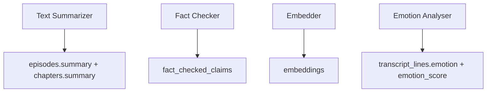
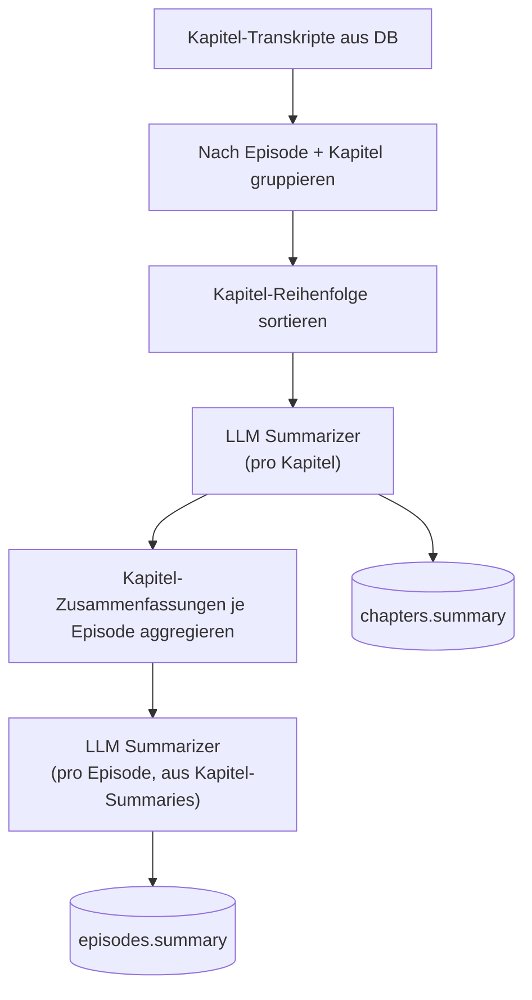
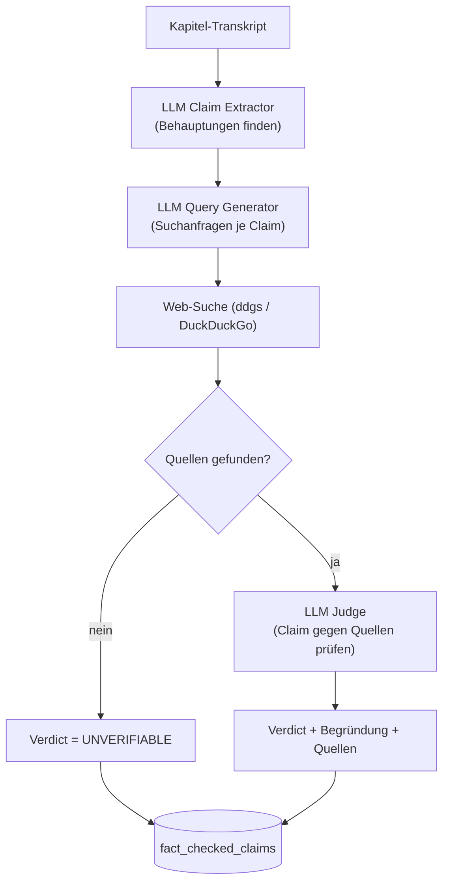
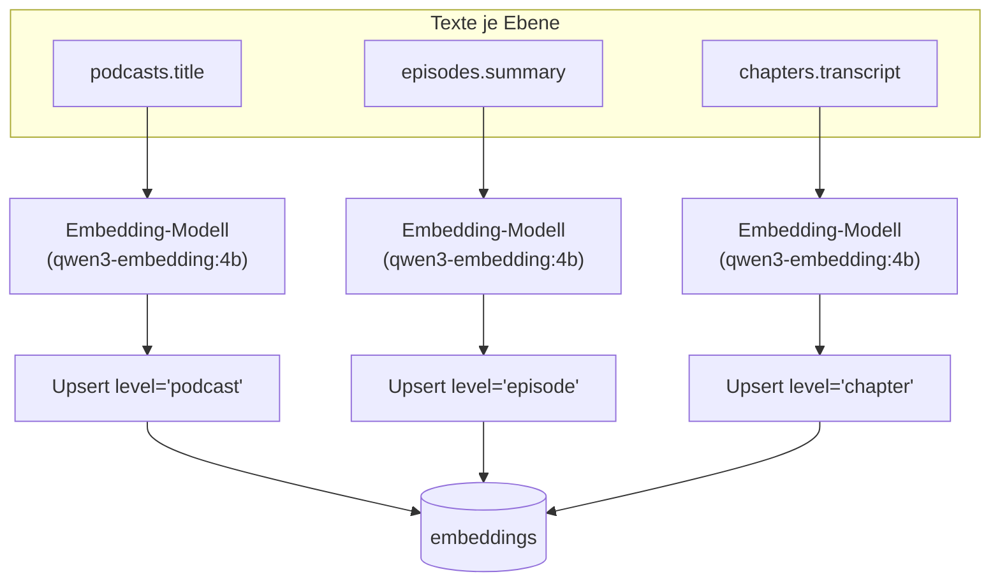
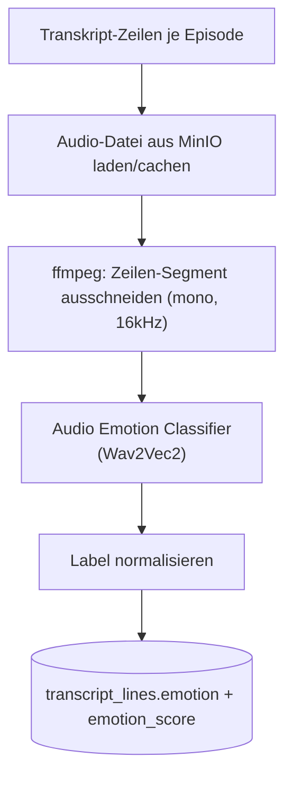

# Module im Detail

Übersicht aller vier Module, jeweils mit Input, Output, Ablauf, Konfiguration und verwendetem Modell.

## Module im Überblick

| Modul | Was es macht | Modell / LLM |
| --- | --- | --- |
| **Text Summarizer** | Fasst Kapitel- und Episoden-Transkripte automatisiert zusammen | LLM via `provider` (z. B. `gemini-2.5-flash` oder lokal über `ollama`), zum Zusammenfassen |
| **Fact Checker** | Extrahiert Behauptungen aus dem Transkript, recherchiert sie im Web und bewertet sie mit Verdict | LLM via `provider` (`gemini`/`ollama`), je einmal zum Extrahieren, Suchanfragen generieren und Bewerten; dazu Web-Suche über `ddgs` (DuckDuckGo) |
| **Embedder** | Erzeugt Vektor-Embeddings auf Podcast-, Episoden- und Kapitel-Ebene für semantische Suche | `qwen3-embedding:4b` über Ollama, reines Embedding-Modell, kein Chat/Reasoning |
| **Emotion Analyser** | Klassifiziert die Emotion einzelner Transkript-Zeilen anhand des zugehörigen Audio-Ausschnitts | `superb/wav2vec2-base-superb-er` (Hugging Face), Audio-Klassifikation, kein LLM |

---

## 1) Text Summarizer

**Zweck:** Fasst Transkripte automatisiert auf zwei Ebenen zusammen, pro Kapitel und pro Episode
(aus den Kapitel-Zusammenfassungen aggregiert).

|                 |                                                                              |
| --------------- | ---------------------------------------------------------------------------- |
| **Input**       | `chapters.transcript`                                                        |
| **Output**      | `episodes.summary`, `chapters.summary`                                       |
| **LLM-Rolle**   | **LLM Summarizer**, fasst einen Text auf Vorgabe-Länge/-Stil zusammen        |
| **Modell**      | via `provider` (`gemini` z. B. `gemini-2.5-flash`, oder lokal über `ollama`) |
| **Kern-Klasse** | `TextSummarizer` (`text_summarizer_core.py`)                                 |
| **Config**      | `text_summarizer_config.json`                                                |

### Ablauf

### Besonderheiten

- Der LLM Summarizer wird zweimal pro Episode eingesetzt: einmal je Kapitel (Input = Kapitel-Transkript)
  und einmal auf Episoden-Ebene (Input = die bereits erzeugten Kapitel-Zusammenfassungen, nicht das Rohtranskript).
- Zwei getrennte Schreibvorgänge: `update_chapter_summaries` und `update_episode_summaries`.
- Beide bekommen denselben `processing_update_ts` (siehe Runner) und optional dieselbe `batch_id`.

---

## 2) Fact Checker

**Zweck:** Extrahiert überprüfbare Behauptungen ("Claims") aus dem Transkript, recherchiert dazu im
Web und bewertet jede Behauptung mit einem Wahrheits-Label.

Im Gegensatz zu den anderen Modulen durchläuft hier ein Claim drei verschiedene LLM-Rollen
hintereinander:

| LLM-Rolle               | Aufgabe                                                 | Input                  | Output                         |
| ----------------------- | ------------------------------------------------------- | ---------------------- | ------------------------------ |
| **LLM Claim Extractor** | Findet überprüfbare Tatsachenbehauptungen im Transkript | Kapitel-Transkript     | Liste von Claim-Strings        |
| **LLM Query Generator** | Formuliert gute Suchanfragen für einen Claim            | Ein Claim              | Liste von Suchanfragen         |
| **LLM Judge**           | Bewertet einen Claim anhand der gefundenen Quellen      | Claim + Suchergebnisse | Verdict + Begründung + Quellen |

|                 |                                                                                                           |
| --------------- | --------------------------------------------------------------------------------------------------------- |
| **Input**       | `chapters.transcript`                                                                                     |
| **Output**      | `fact_checked_claims` (eine Zeile pro Claim)                                                              |
| **Modell**      | via `provider` (`gemini`/`ollama`) für alle drei LLM-Rollen + Web-Suche über `ddgs` (Backend: DuckDuckGo) |
| **Kern-Klasse** | `FactChecker` (`fact_checker_core.py`)                                                                    |
| **Config**      | `fact_checker_config.json`                                                                                |

### Ablauf

### Verdict-Werte (vom LLM Judge vergeben)

`TRUE`, `MOSTLY_TRUE`, `MISLEADING`, `FALSE`, `UNVERIFIABLE` (konfigurierbar über `allowed_verdicts`).

### Besonderheiten

- Schreibt per `INSERT ... ON CONFLICT (chapter_id, claim_idx) DO UPDATE`. Ein erneuter Lauf
  überschreibt vorhandene Claims desselben Kapitels statt sie zu duplizieren.
- Findet die Recherche keine Quellen, wird der Claim trotzdem gespeichert (als `UNVERIFIABLE`),
  damit kein Claim verschwindet. Der LLM Judge wird in diesem Fall gar nicht erst aufgerufen.
- Web-Suche läuft über ein konfigurierbares, festes Such-Backend (`search_backend`, Standard
  `duckduckgo`) mit Timeout und Fail-Fast bei reinen Verbindungsfehlern (siehe `fact_checker_core.py`).

---

## 3) Embedder (Transcript Embedder)

**Zweck:** Erzeugt Vektor-Repräsentationen (Embeddings) auf drei Ebenen für semantische Suche/Ähnlichkeit
(z. B. "finde ähnliche Kapitel/Episoden/Podcasts").

### Was wird auf welcher Ebene tatsächlich embedded?

| Ebene (`level`) | Was wird embedded?                                          | Quellspalte           | Bedeutung                                                      |
| --------------- | ----------------------------------------------------------- | ---------------------- | -------------------------------------------------------------- |
| `chapter`       | Der volle Transkript-Text des Kapitels                      | `chapters.transcript` | Feinkörnigste Ebene, Inhalt eines einzelnen Kapitels           |
| `episode`       | Die Episoden-Zusammenfassung (nicht das Rohtranskript)       | `episodes.summary`    | Setzt voraus, dass `text_summarizer` vorher gelaufen ist       |
| `podcast`       | Der Podcast-Titel                                            | `podcasts.title`      | Gröbste Ebene, dient v. a. der groben thematischen Einordnung |

Läuft `embedder` vor `text_summarizer` (oder ohne, dass je eine Summary
existiert), gibt es auf Episoden-Ebene schlicht noch nichts zu embedden.

|                 |                                                                                       |
| --------------- | ------------------------------------------------------------------------------------- |
| **Output**      | `embeddings` (Spalte `level` ∈ `podcast \| episode \| chapter`)                       |
| **Modell**      | `qwen3-embedding:4b` über Ollama (kein LLM-Chat, sondern ein reines Embedding-Modell) |
| **Kern-Klasse** | `TranscriptEmbedder` (`transcript_embedder_core.py`)                                  |
| **Config**      | `transcript_embedder_config.json`                                                     |

### Ablauf

### Besonderheiten

- Wird dreimal pro Lauf ausgeführt (einmal je Level: `podcast`, `episode`, `chapter`). Jedes
  Level hat seine eigene Delta-Prüfung (siehe [02_load_strategy.md](02_load_strategy.md)) und seine
  eigene Quellspalte (siehe Tabelle oben).
- Texte werden vor dem Embedding-Call gebündelt (`batch_size`, Standard `32`).
- Speichert den Vektor als `halfvec` (kompakterer Datentyp für pgvector).
- Konfliktauflösung pro Level über einen partiellen Unique-Index, z. B.
  `(chapter_id) WHERE level = 'chapter'`. Ein erneuter Lauf überschreibt den bestehenden Vektor
  statt einen zweiten anzulegen.

---

## 4) Emotion Analyser

**Zweck:** Erkennt die vorherrschende Emotion in einzelnen Transkript-Zeilen anhand des zugehörigen
Audio-Ausschnitts. Kein LLM, sondern ein spezialisiertes Audio-Klassifikationsmodell.

|                  |                                                                                           |
| ---------------- | ----------------------------------------------------------------------------------------- |
| **Input**        | Audio-Datei der Episode (aus MinIO, Bucket `bronze`) + Start-/Endzeit je Transkript-Zeile |
| **Output**       | `transcript_lines.emotion` (Label) + `transcript_lines.emotion_score` (Konfidenz)         |
| **Modell-Rolle** | **Audio Emotion Classifier**                                                              |
| **Modell**       | `superb/wav2vec2-base-superb-er` (Hugging Face, Audio-Klassifikation)                     |
| **Kern-Klasse**  | `EmotionAnalyser` (`emotion_analyser.py`)                                                 |
| **Config**       | `emotion_analyser_config.json`                                                            |

### Ablauf

### Emotion-Labels

Die rohen Modell-Labels werden über `EmotionLabelCatalog` normalisiert:

| Roh-Label | Normalisiertes Label |
| --------- | -------------------- |
| `neu`     | `neutral`            |
| `hap`     | `happy`              |
| `ang`     | `angry`              |
| `sad`     | `sad`                |

### Besonderheiten

- Audio-Caching: Episoden-Audiodateien werden pro Episode nur einmal aus MinIO geladen und in
  einem lokalen Cache-Verzeichnis (`audio_cache_dir`) abgelegt. Alle Zeilen derselben Episode
  greifen auf dieselbe lokale Datei zu, nur einzelne Segmente werden per `ffmpeg` ausgeschnitten.
- Diese Segmente landen in einem temporären Verzeichnis (`tempfile.TemporaryDirectory`) als
  `{transcript_line_id}.wav`. Sie werden nicht in MinIO oder die DB hochgeladen, nur lokal an den
  Classifier übergeben, und nach dem Lauf automatisch gelöscht.
- Fehlt eine Audiodatei in MinIO (`S3Error: NoSuchKey`), wird die betroffene Episode übersprungen
  statt den ganzen Lauf abzubrechen.
- Dieser Step hat keine Test-/Watermark-Parameter (`--testing` etc.) wie die anderen drei Steps.
