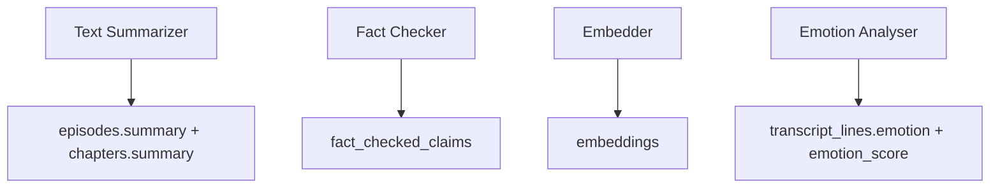
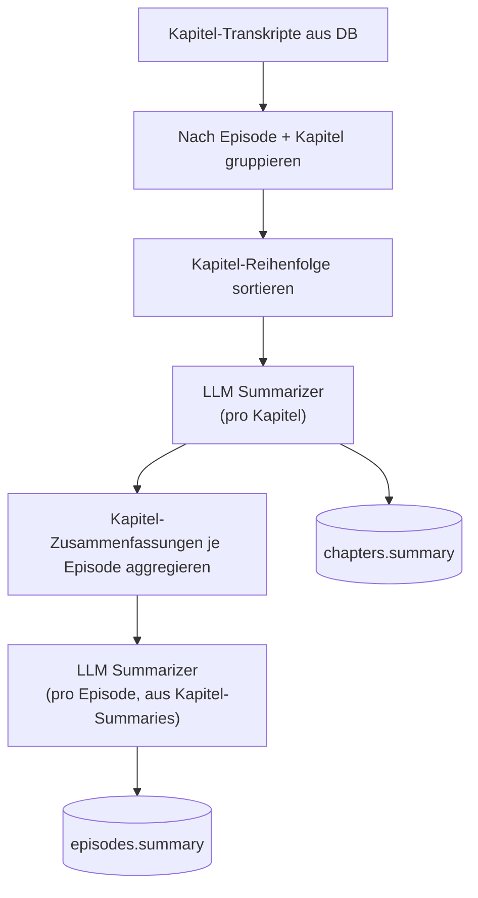
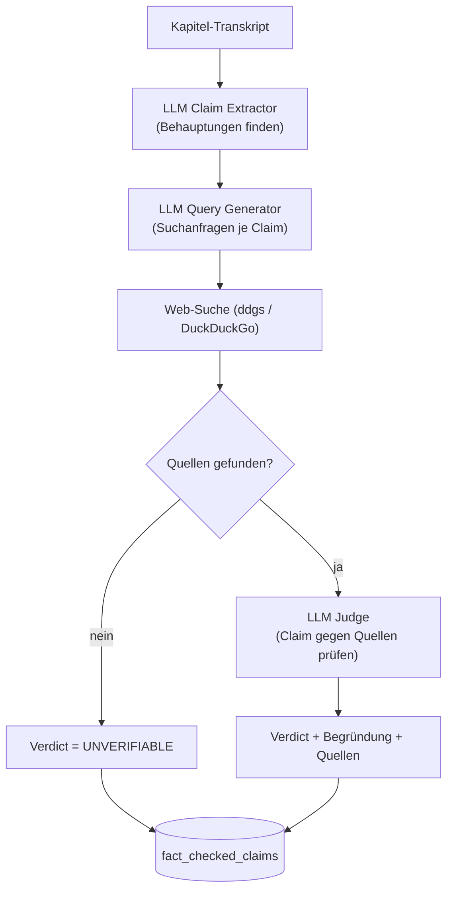
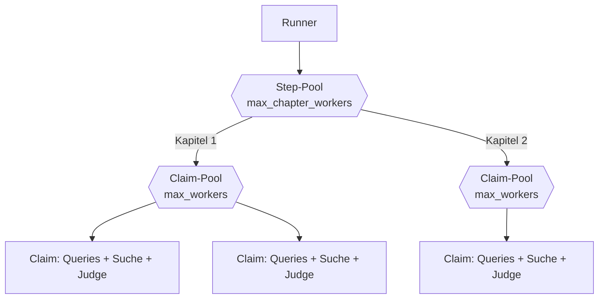
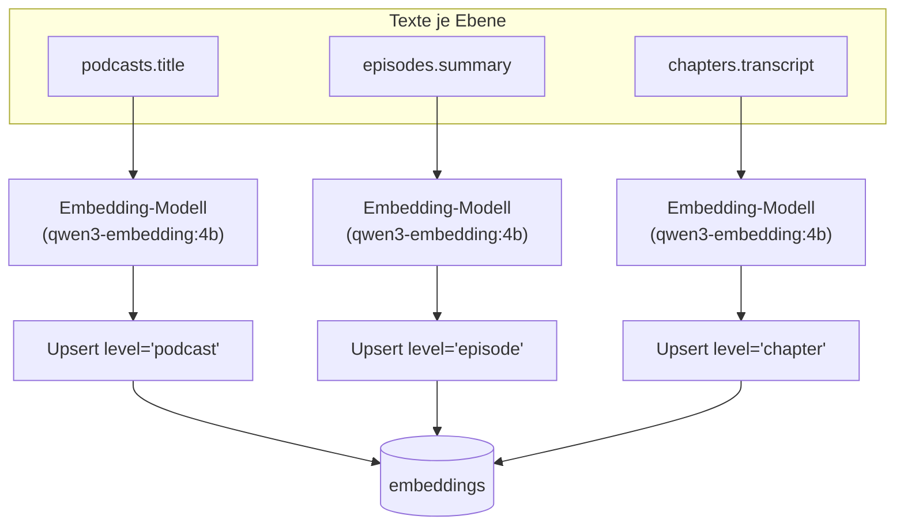
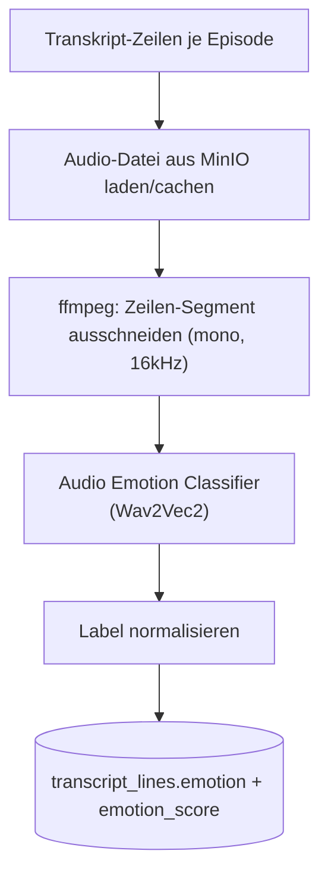

# Module im Detail

Übersicht aller vier Module, jeweils mit Input, Output, Ablauf, Konfiguration und verwendetem Modell.



## Module im Überblick

| Modul                | Was es macht                                                                                     | Modell / LLM                                                                                                                                     |
| -------------------- | ------------------------------------------------------------------------------------------------ | ------------------------------------------------------------------------------------------------------------------------------------------------ |
| **Text Summarizer**  | Fasst Kapitel- und Episoden-Transkripte automatisiert zusammen                                   | LLM via `provider` (z. B. `gemini-3.5-flash` oder lokal über `ollama`), zum Zusammenfassen                                                       |
| **Fact Checker**     | Extrahiert Behauptungen aus dem Transkript, recherchiert sie im Web und bewertet sie mit Verdict | LLM via `provider` (`gemini`/`ollama`), je einmal zum Extrahieren, Suchanfragen generieren und Bewerten; dazu Web-Suche über `ddgs` (DuckDuckGo) |
| **Embedder**         | Erzeugt Vektor-Embeddings auf Podcast-, Episoden- und Kapitel-Ebene für semantische Suche        | Embedding-Modell via `provider` (`ollama` z. B. `qwen3-embedding:4b`, oder `gemini` z. B. `gemini-embedding-001`), reines Embedding-Modell, kein Chat/Reasoning |
| **Emotion Analyser** | Klassifiziert die Emotion einzelner Transkript-Zeilen anhand des zugehörigen Audio-Ausschnitts   | `superb/wav2vec2-base-superb-er` (Hugging Face), Audio-Klassifikation, kein LLM                                                                  |

---

## 1) Text Summarizer

**Zweck:** Fasst Transkripte automatisiert auf zwei Ebenen zusammen, pro Kapitel und pro Episode
(aus den Kapitel-Zusammenfassungen aggregiert).

|                 |                                                                              |
| --------------- | ---------------------------------------------------------------------------- |
| **Input**       | `chapters.transcript`                                                        |
| **Output**      | `episodes.summary`, `chapters.summary`                                       |
| **LLM-Rolle**   | **LLM Summarizer**, fasst einen Text auf Vorgabe-Länge/-Stil zusammen        |
| **Modell**      | via `provider` (`gemini` z. B. `gemini-3.5-flash`, oder lokal über `ollama`) |
| **Kern-Klasse** | `TextSummarizer` (`text_summarizer_core.py`)                                 |
| **Config**      | `text_summarizer_config.json`                                                |

### Ablauf



### Prompt-Strategie (Ausschnitt)

Zwei feste `PromptTemplate`s, kein System-Prompt. Die Rolle steht direkt im User-Prompt:

```text
# Kapitel-Prompt
Summarize the following podcast chapter in 1-3 sentences maximum.
Be concise and capture only the core message.
{text}
Return ONLY the summary, no explanations or commentary.

# Episoden-Prompt
You are summarizing a complete podcast episode.
{text}
Create:
1. An overall summary (2-3 sentences)
2. Key takeaways of the highlights (bullet list)
```

- Hier kommt **Freitext** raus, kein JSON-Schema (anders als beim `fact_checker`). Die Ausgabe
  geht direkt in `chapters.summary` / `episodes.summary`.
- `temperature: 0.0`, damit bei gleichem Input möglichst die gleiche Zusammenfassung rauskommt.

### Besonderheiten

- Der LLM Summarizer wird zweimal pro Episode eingesetzt: einmal je Kapitel (Input = Kapitel-Transkript)
  und einmal auf Episoden-Ebene (Input = die bereits erzeugten Kapitel-Zusammenfassungen, nicht das Rohtranskript).
- Zwei getrennte Schreibvorgänge: `update_chapter_summaries` und `update_episode_summaries`.
- Beide bekommen denselben `processing_update_ts` (siehe Runner) und optional dieselbe `batch_id`.

---

## 2) Fact Checker

**Zweck:** Extrahiert überprüfbare Behauptungen ("Claims") aus dem Transkript, recherchiert dazu im
Web und bewertet jede Behauptung mit einem Wahrheits-Label.

Im Gegensatz zu den anderen Modulen durchläuft hier ein Claim drei verschiedene LLM-Rollen
hintereinander:

| LLM-Rolle               | Aufgabe                                                 | Input                  | Output                         |
| ----------------------- | ------------------------------------------------------- | ---------------------- | ------------------------------ |
| **LLM Claim Extractor** | Findet überprüfbare Tatsachenbehauptungen im Transkript | Kapitel-Transkript     | Liste von Claim-Strings        |
| **LLM Query Generator** | Formuliert gute Suchanfragen für einen Claim            | Ein Claim              | Liste von Suchanfragen         |
| **LLM Judge**           | Bewertet einen Claim anhand der gefundenen Quellen      | Claim + Suchergebnisse | Verdict + Begründung + Quellen |

|                 |                                                                                                           |
| --------------- | --------------------------------------------------------------------------------------------------------- |
| **Input**       | `chapters.transcript`                                                                                     |
| **Output**      | `fact_checked_claims` (eine Zeile pro Claim)                                                              |
| **Modell**      | via `provider` (`gemini`/`ollama`) für alle drei LLM-Rollen + Web-Suche über `ddgs` (Backend: DuckDuckGo) |
| **Kern-Klasse** | `FactChecker` (`fact_checker_core.py`)                                                                    |
| **Config**      | `fact_checker_config.json`                                                                                |

### Ablauf



### Verdict-Werte (vom LLM Judge vergeben)

`TRUE`, `MOSTLY_TRUE`, `MISLEADING`, `FALSE`, `UNVERIFIABLE` (konfigurierbar über `allowed_verdicts`).

### Prompt-Strategie (Ausschnitt)

Alle drei LLM-Rollen verlangen striktes JSON als Ausgabe (kein Markdown, keine Erklärtexte). Das
ist nötig, weil die Antwort direkt weiterverarbeitet wird (`_parse_json`):

```text
# LLM Claim Extractor (System-Prompt)
You are an expert in extracting factual claims from transcript text.
Rules:
1. Extract only verifiable, real-world factual claims.
2. Ignore pure opinions, jokes, speculation, rhetorical questions and personal preferences.
IMPORTANT: A claim does NOT become an opinion just because it is stated in a conversation.
3. Return ONLY a JSON list of claim strings. No markdown.
4. If no factual claims exist, return [].

# LLM Judge (System-Prompt)
You are a professional fact checker.
Use ONLY the provided evidence. Do not use outside knowledge.
The explanation MUST BE concise and easy to understand.
Allowed verdicts: {allowed_verdicts}
Return ONLY valid JSON with this schema:
{"claim": "...", "verdict": "...", "explanation": "...", "sources": ["https://..."]}
```

- **"Use ONLY the provided evidence"** ist die wichtigste Zeile im Judge-Prompt. Sie verhindert,
  dass das LLM aus seinem Trainingswissen urteilt statt anhand der gefundenen Quellen. Sonst wäre
  das Verdict nicht durch `sources` nachvollziehbar.
- `allowed_verdicts` wird **dynamisch** in den System-Prompt eingesetzt. So wirkt eine Änderung in
  der Config (z. B. ein zusätzliches Verdict) ohne Code-Änderung.

### Parallelisierung: zwei Ebenen

Es gibt **zwei verschachtelte** Thread-Pools, also eine Ebene mehr als bei den anderen drei Modulen:



1. **Kapitel-Ebene** (`02_pipeline_fact_checker.py`, Step-Skript): mehrere Kapitel werden
   gleichzeitig fact-checked. Gesteuert über `max_chapter_workers` (Standard `2`). Dieser Wert
   steht in der **`fact_checker_config.json`**, nicht in der Pipeline-Config (siehe
   [03_parameters.md](03_parameters.md)).
2. **Claim-Ebene** (`fact_checker_core.py`, Modul-Kern): innerhalb eines Kapitels sind die
   einzelnen Claims voneinander unabhängig. Deshalb laufen sowohl die Recherche
   (`_research_one_claim`) als auch die Bewertung (`_verify_one_claim`) über einen eigenen
   `ThreadPoolExecutor`, gesteuert über `max_workers` (Standard `4`). Effektiv wird
   `min(max_workers, Anzahl Claims)` genutzt. Die Arbeit ist I/O-lastig (HTTP zum LLM + Websuche),
   deshalb bringen Threads trotz GIL einen echten Speedup.

- **Worst-Case-Nebenläufigkeit:** `max_chapter_workers × max_workers` gleichzeitige
  Such-/LLM-Aufrufe (Standard: `2 × 4 = 8`). Bei Rate-Limit-Fehlern (HTTP 429, DuckDuckGo-Blocks)
  einen der beiden Werte reduzieren. Beide gehen multiplikativ in die Gesamtlast ein.
- Jeder Recherche-Worker bekommt eine **eigene `DDGS`-Instanz** (DDGS ist nicht thread-sicher).
- Die **Reihenfolge der Claims bleibt erhalten** (Ergebnisse werden über den Index einsortiert),
  damit `claim_idx` stabil bleibt und `ON CONFLICT (chapter_id, claim_idx)` bei jedem Lauf
  denselben Claim trifft.
- In den Logs trägt jede Zeile ein Label `[research N/M]` bzw. `[verify N/M]`, damit sich die
  ineinander verschachtelten Ausgaben paralleler Claims auseinanderhalten lassen.

### Suchfehler: kein Retry, einfach überspringen

Frühere Versionen versuchten eine fehlgeschlagene Suchanfrage bis zu dreimal mit exponentiellem
Backoff (0.5s, 1s, 2s) erneut. Das wurde entfernt:

- Jede Suchanfrage wird **genau einmal** versucht. Schlägt sie fehl (keine Ergebnisse,
  Verbindungsfehler usw.), wird sie übersprungen und mit den übrigen Anfragen weitergemacht. Keine
  Wartezeit, kein zweiter Versuch.
- Grund: Bei einer kostenlosen Such-API (DuckDuckGo über `ddgs`), die schnell rate-limitet, bringt
  ein Retry mit Backoff in der Praxis kaum Erfolg. Er verlangsamt aber den ganzen Kapitel-Lauf
  spürbar, weil jeder Retry seinen Worker-Slot für die Backoff-Zeit blockiert.
- Findet keine der Anfragen eines Claims Quellen, wird der Claim trotzdem gespeichert (als
  `UNVERIFIABLE`), damit kein Claim verschwindet.

### Besonderheiten

- Schreibt per `INSERT ... ON CONFLICT (chapter_id, claim_idx) DO UPDATE`. Ein erneuter Lauf
  überschreibt vorhandene Claims desselben Kapitels statt sie zu duplizieren.
- Der LLM Judge wird nur aufgerufen, wenn mindestens eine Quelle gefunden wurde. Ohne Quellen gibt
  es direkt `UNVERIFIABLE`, ganz ohne LLM-Aufruf.
- Web-Suche läuft über ein konfigurierbares Such-Backend (`search_backend`, Standard
  `duckduckgo`) mit Timeout (`search_timeout`).

---

## 3) Embedder (Transcript Embedder)

**Zweck:** Erzeugt Vektor-Repräsentationen (Embeddings) auf drei Ebenen für semantische Suche/Ähnlichkeit
(z. B. "finde ähnliche Kapitel/Episoden/Podcasts").

### Was wird auf welcher Ebene tatsächlich embedded?

| Ebene (`level`) | Was wird embedded?                                     | Quellspalte           | Bedeutung                                                     |
| --------------- | ------------------------------------------------------ | --------------------- | ------------------------------------------------------------- |
| `chapter`       | Der volle Transkript-Text des Kapitels                 | `chapters.transcript` | Feinkörnigste Ebene, Inhalt eines einzelnen Kapitels          |
| `episode`       | Die Episoden-Zusammenfassung (nicht das Rohtranskript) | `episodes.summary`    | Setzt voraus, dass `text_summarizer` vorher gelaufen ist      |
| `podcast`       | Der Podcast-Titel                                      | `podcasts.title`      | Gröbste Ebene, dient v. a. der groben thematischen Einordnung |

Läuft `embedder` vor `text_summarizer` (oder ohne, dass je eine Summary
existiert), gibt es auf Episoden-Ebene schlicht noch nichts zu embedden.

|                 |                                                                                       |
| --------------- | ------------------------------------------------------------------------------------- |
| **Output**      | `embeddings` (Spalte `level` ∈ `podcast \| episode \| chapter`)                       |
| **Modell**      | via `provider`: `ollama` (lokal, z. B. `qwen3-embedding:4b`) oder `gemini` (Google Generative AI Embeddings, z. B. `gemini-embedding-001`). Kein LLM-Chat, ein reines Embedding-Modell |
| **Kern-Klasse** | `TranscriptEmbedder` (`transcript_embedder_core.py`)                                  |
| **Config**      | `transcript_embedder_config.json`                                                     |

### Ablauf



### Prompt-Strategie (Ausschnitt)

Kein Chat-Prompt, sondern ein fester **Instruktions-Präfix** (`task_instruction`), der jedem zu
embeddenden Text vorangestellt wird:

```text
Represent this podcast transcript segment for semantic retrieval: {text}
```

- Embedding-Modelle wie `qwen3-embedding` sind oft auf solche kurzen "Instruction"-Präfixe
  trainiert, um den Einsatzzweck des Vektors zu steuern (hier: Retrieval statt z. B.
  Klassifikation). Deshalb braucht es keinen vollwertigen Prompt wie bei den LLM-Modulen.
- Konfigurierbar über `task_instruction` in `transcript_embedder_config.json`, ohne Code-Änderung.

### Provider: `ollama` vs. `gemini`

- `provider: "ollama"` (Standard): ruft `ollama.embed(model=...)` lokal auf. Erwartet einen
  laufenden Ollama-Server mit dem konfigurierten Modell (z. B. `qwen3-embedding:4b`).
- `provider: "gemini"`: nutzt `GoogleGenerativeAIEmbeddings` (`langchain-google-genai`) gegen die
  Google-Generative-AI-API. Benötigt `GEMINI_API_KEY` in der `.env`-Datei im Projekt-Root
  (gleiche Variable wie bei `text_summarizer`/`fact_checker`).
- `dimension` steuert bei `gemini` den Parameter `output_dimensionality`. Modelle wie
  `gemini-embedding-001` können verkürzte Ausgabedimensionen liefern. So lassen sich z. B. weiterhin
  2560 Dimensionen erzeugen, damit es zur bestehenden Spalte `embeddings.embedding halfvec(2560)`
  passt, ohne die DB-Spalte umbauen zu müssen.
- Nach jedem Embedding-Aufruf wird die tatsächliche Vektor-Länge gegen `dimension` geprüft. Passt
  sie nicht, bricht der Lauf sofort mit einem klaren Fehler ab, statt eine zur DB-Spalte
  inkompatible Zeile einzufügen.

### Besonderheiten

- Wird dreimal pro Lauf ausgeführt (einmal je Level: `podcast`, `episode`, `chapter`). Jedes
  Level hat seine eigene Delta-Prüfung (siehe [02_load_strategy.md](02_load_strategy.md)) und seine
  eigene Quellspalte (siehe Tabelle oben).
- Texte werden vor dem Embedding-Call gebündelt (`batch_size`, Standard `32`).
- Speichert den Vektor als `halfvec` (kompakterer Datentyp für pgvector).
- Konfliktauflösung pro Level über einen partiellen Unique-Index, z. B.
  `(chapter_id) WHERE level = 'chapter'`. Ein erneuter Lauf überschreibt den bestehenden Vektor
  statt einen zweiten anzulegen.

---

## 4) Emotion Analyser

**Zweck:** Erkennt die vorherrschende Emotion in einzelnen Transkript-Zeilen anhand des zugehörigen
Audio-Ausschnitts. Kein LLM, sondern ein spezialisiertes Audio-Klassifikationsmodell.

|                  |                                                                                           |
| ---------------- | ----------------------------------------------------------------------------------------- |
| **Input**        | Audio-Datei der Episode (aus MinIO, Bucket `bronze`) + Start-/Endzeit je Transkript-Zeile |
| **Output**       | `transcript_lines.emotion` (Label) + `transcript_lines.emotion_score` (Konfidenz)         |
| **Modell-Rolle** | **Audio Emotion Classifier**                                                              |
| **Modell**       | `superb/wav2vec2-base-superb-er` (Hugging Face, Audio-Klassifikation)                     |
| **Kern-Klasse**  | `EmotionAnalyser` (`emotion_analyser.py`)                                                 |
| **Config**       | `emotion_analyser_config.json`                                                            |

### Ablauf



### Emotion-Labels

Die rohen Modell-Labels werden über `EmotionLabelCatalog` normalisiert:

| Roh-Label | Normalisiertes Label |
| --------- | -------------------- |
| `neu`     | `neutral`            |
| `hap`     | `happy`              |
| `ang`     | `angry`              |
| `sad`     | `sad`                |

### Besonderheiten

- Audio-Caching: Episoden-Audiodateien werden pro Episode nur einmal aus MinIO geladen und in
  einem lokalen Cache-Verzeichnis (`audio_cache_dir`) abgelegt. Alle Zeilen derselben Episode
  greifen auf dieselbe lokale Datei zu, nur einzelne Segmente werden per `ffmpeg` ausgeschnitten.
- Diese Segmente landen in einem temporären Verzeichnis (`tempfile.TemporaryDirectory`) als
  `{transcript_line_id}.wav`. Sie werden nicht in MinIO oder die DB hochgeladen, nur lokal an den
  Classifier übergeben, und nach dem Lauf automatisch gelöscht.
- Fehlt eine Audiodatei in MinIO (`S3Error: NoSuchKey`), wird die betroffene Episode übersprungen
  statt den ganzen Lauf abzubrechen.
- Dieser Step hat keine Test-/Watermark-Parameter (`--testing` etc.) wie die anderen drei Steps.
