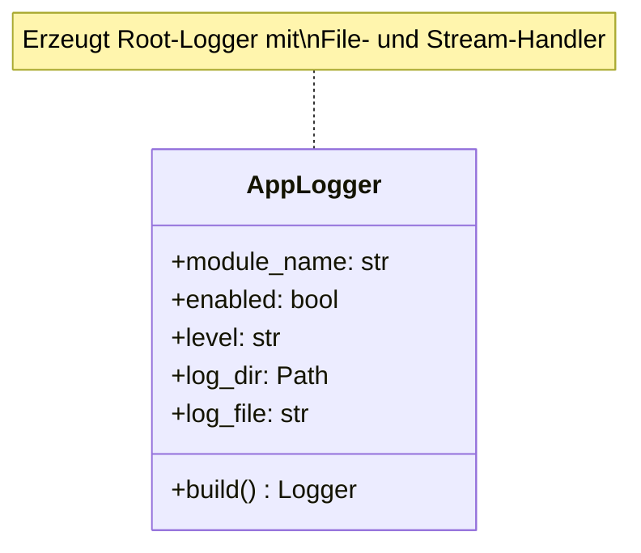
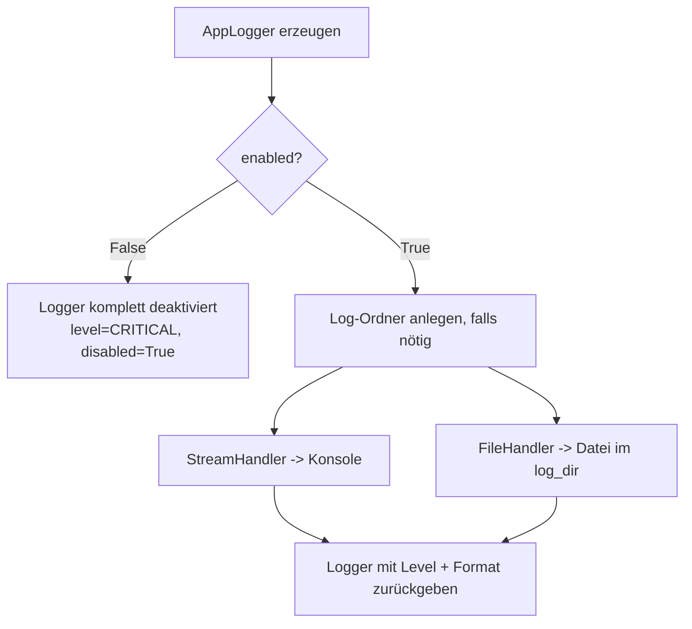
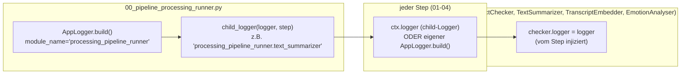

# Logger-Integration

## Zentrale Logger-Fabrik: `AppLogger` und `child_logger`

Alle Module nutzen dieselbe kleine Hilfsklasse aus
[`common/app_logger.py`](../../src/02_processing/common/app_logger.py), damit Logging überall
gleich aussieht und sich gleich verhält.



### Was macht `AppLogger.build()`?



- Konsole und Datei gleichzeitig, wenn aktiviert.
- Format: `%(asctime)s | %(levelname)s | %(name)s | %(message)s`
- Wiederholtes Aufrufen von `build()` entfernt vorherige Handler zuerst, so entstehen keine
  doppelten Log-Zeilen, wenn derselbe Logger mehrfach konfiguriert wird.
- Ist `enabled=False`, wird der Logger nicht nur leise gemacht, sondern deaktiviert
  (`logger.disabled = True`), es entsteht praktisch kein Overhead.

### Was macht `child_logger(parent, name)`?

`child_logger(parent, name)` erzeugt einen Kind-Logger mit dem Namen `<parent_name>.<name>`,
der keine eigenen Handler hat (`propagate=True`) und seine Log-Zeilen stattdessen an den
Eltern-Logger weiterleitet. Dadurch:

- Erscheint in `%(name)s` automatisch z. B. `processing_pipeline_runner.text_summarizer`
  statt nur `processing_pipeline_runner` — welcher Step die Zeile erzeugt hat, ist sofort
  erkennbar, ohne den Log-Inhalt zu parsen.
- Alle Zeilen landen im selben Log-File wie der Runner, ohne Handler-Duplizierung.

## Wo wird der Logger erzeugt?



1. **Runner-Ebene**: Der Runner erzeugt einen Logger (`processing_pipeline_runner`) und legt ihn
   im `LoadContext` (`ctx.logger`) ab.
2. **Child-Logger pro Step**: Bevor `run_step(...)` aufgerufen wird, erzeugt der Runner per
   `child_logger(logger, step)` einen Kind-Logger, z. B. `processing_pipeline_runner.fact_checker`.
   Dieser wird mit `dataclasses.replace(ctx, logger=step_logger)` in eine step-spezifische
   `LoadContext`-Kopie eingebettet, damit der ursprüngliche `ctx` unverändert bleibt.
3. **Step-Ebene**: Wird ein Step über den Runner aufgerufen, nutzt er `ctx.logger` (den
   Child-Logger). Wird er eigenständig aufgerufen (`python 01_pipeline_text_summarizer.py ...`),
   baut er sich seinen eigenen Logger per `AppLogger(...).build()`.
4. **Modul-Ebene**: Der Step reicht den Logger an die fachliche Klasse weiter
   (`checker.logger = logger`, `summarizer.logger = logger`, `embedder.logger = logger`,
   `analyser.logger = logger`), damit auch die Kern-Logik (LLM-Aufrufe, Web-Suche,
   Audio-Klassifikation, ...) mitloggen kann.

Dadurch landen alle Log-Zeilen eines Laufs, egal ob Runner, Step oder Modul-Logik, im selben
Format und im selben Log-Verzeichnis. Gleichzeitig ist jede Zeile eindeutig dem erzeugenden Step
zuzuordnen.

## Konfiguration pro Modul/Step

Jeder Step und jedes Modul hat dieselben vier Logging-Parameter (CLI und/oder JSON-Config):

| Parameter                       | Bedeutung                                       |
| ------------------------------- | ----------------------------------------------- |
| `log_enabled` / `--log-enabled` | Logging an/aus                                  |
| `log_level` / `--log-level`     | `DEBUG`, `INFO`, `WARNING`, `ERROR`, `CRITICAL` |
| `log_dir` / `--log-dir`         | Zielordner (Standard: `silver_enriched/logs/`)  |
| `log_file` / `--log-file`       | Dateiname, z. B. `fact_checker.log`             |

### Log-Dateien im Projekt

```text
src/02_processing/silver_enriched/logs/
├── processing_pipeline.log         # Runner-Gesamtlauf (enthält alle Steps)
├── text_summarizer_pipeline.log    # eigenständiger Modul-Lauf
├── fact_checker_pipeline.log
├── embedder_pipeline.log
└── emotion_scoring_pipeline.log
```

Hinweis: Wird ein Step über den Runner ausgeführt, schreibt er standardmäßig in dieselbe Datei
wie der Runner (`processing_pipeline.log`), da er `ctx.logger` (den Child-Logger) wiederverwendet.
Nur bei eigenständigem Aufruf entsteht eine separate, modulspezifische Log-Datei.

## Was wird geloggt?

### Runner (`processing_pipeline_runner`)

| Phase                  | Beispiel-Log-Zeile                                                                                                          |
| ---------------------- | --------------------------------------------------------------------------------------------------------------------------- |
| Lauf-Start             | `pipeline: start mode=delta dry_run=False steps=embedder,emotion_scoring,fact_checker,text_summarizer batch_id=- workers=-` |
| Step-Start             | `step: start text_summarizer`                                                                                               |
| Step-Ende              | `step: done text_summarizer`                                                                                                |
| Step-Fehler            | `pipeline: step failed text_summarizer` (inkl. Stacktrace via `logger.exception`)                                           |
| Lauf-Ende              | `pipeline: done`                                                                                                            |
| Fehler-Zusammenfassung | `pipeline: failed steps=text_summarizer`                                                                                    |

### `pipeline_utils.py` — Batch-Lifecycle & Fetch

| Phase                   | Beispiel-Log-Zeile                                                                                                                               |
| ----------------------- | ------------------------------------------------------------------------------------------------------------------------------------------------ |
| Batch angelegt          | `pipeline_batch: created batch_id=<uuid> stage=text_summarizer mode=delta`                                                                       |
| Batch abgeschlossen     | `pipeline_batch: finalized batch_id=<uuid> status=success`                                                                                       |
| Batch fehlgeschlagen    | `pipeline_batch: finalized batch_id=<uuid> status=failed`                                                                                        |
| Dry-Run (kein Batch)    | `pipeline_batch: dry run, no batch created stage=text_summarizer`                                                                                |
| Fetch (delta)           | `fetch_chunks: step=fact_checker level=chapter mode=delta watermark=2026-05-10 08:00:00+00:00 rows=42`                                           |
| Fetch (full)            | `fetch_chunks: step=embedder level=chapter mode=full rows=120`                                                                                   |
| Chapter-IDs geholt      | `fetch: chapter_ids episode_id=<uuid> rows=3`                                                                                                    |
| Pro-Zeile Debug         | `chunk=<id> step=fact_checker level=chapter reason=preprocessing_gt_watermark preprocessing_updated_at=... stage_watermark=... test_end_ts=None` |
| Rollback fehlgeschlagen | `pipeline_batch: rollback failed stage=fact_checker batch_id=<uuid>` (inkl. Stacktrace)                                                          |

Der `reason`-Wert im Debug-Log kann sein: `full_load`, `no_batch_watermark`,
`preprocessing_gt_watermark`, `preprocessing_lte_watermark`.

### `text_summarizer`

| Phase   | Beispiel-Log-Zeile                                                 |
| ------- | ------------------------------------------------------------------ |
| Leer    | `text_summarizer: no chapters to process`                          |
| Start   | `text_summarizer: start mode=delta chapters=12`                    |
| Bereit  | `text_summarizer: summaries ready episodes=3 chapters=12`          |
| Dry-Run | `text_summarizer: dry run, skipping writes episodes=3 chapters=12` |
| Ende    | `text_summarizer: done episodes=3 chapters=12 batch_id=<uuid>`     |

### `fact_checker`

| Phase            | Beispiel-Log-Zeile                                      |
| ---------------- | ------------------------------------------------------- |
| Leer             | `fact_checker: no chapters to process`                  |
| Start            | `fact_checker: start mode=delta chapters=8`             |
| Kapitel (DEBUG)  | `fact_checker: checking chapter_id=<uuid>`              |
| Kapitel fertig   | `fact_checker: chapter done chapter_id=<uuid> claims=5` |
| Keine Claims     | `fact_checker: no claims extracted from any chapter`    |
| Claims-Überblick | `fact_checker: extracted claims=40 from chapters=8`     |
| Dry-Run          | `fact_checker: dry run, skipping writes`                |
| Ende             | `fact_checker: done claims=40 batch_id=<uuid>`          |

### `embedder`

| Phase     | Beispiel-Log-Zeile                                 |
| --------- | -------------------------------------------------- |
| Start     | `embedder: start mode=delta`                       |
| Leer      | `embedder: no items to embed level=episode`        |
| Pro Level | `embedder: embedding level=chapter items=12`       |
| Dry-Run   | `embedder: dry run, skipping writes level=chapter` |
| Ende      | `embedder: done rows=36 batch_id=<uuid>`           |

### `emotion_scoring`

| Phase           | Beispiel-Log-Zeile                                                                                                                              |
| --------------- | ----------------------------------------------------------------------------------------------------------------------------------------------- |
| Start           | `emotion_scoring: start mode=delta episodes=5 lines=240`                                                                                        |
| Audio-Download  | `emotion_scoring: downloading audio episode_id=<uuid> audio_key=...`                                                                            |
| Cache-Hit       | `emotion_scoring: audio cache hit episode_id=<uuid> audio_key=...`                                                                              |
| Pro Episode     | `emotion_scoring: processing episode_id=<uuid> lines=48`                                                                                        |
| Zeile (DEBUG)   | `emotion_scoring: scoring line_id=<uuid> episode_id=<uuid> start=12.50 end=15.30`                                                               |
| Kurzton-Warning | `emotion_scoring: skipping line_id=<uuid> episode_id=<uuid>: Audio segment too short for emotion scoring: 120 samples (minimum 400). File: ...` |
| Episode fertig  | `emotion_scoring: episode done episode_id=<uuid> scored=45 skipped=3`                                                                           |
| Dry-Run         | `emotion_scoring: dry run, skipping 240 writes`                                                                                                 |
| Ende            | `emotion_scoring: done scored=240 batch_id=<uuid>`                                                                                              |
| Audio fehlt     | `emotion_scoring: audio file not found in storage, skipping episode episode_id=<uuid> audio_key=...`                                            |

## Fehlerbehandlung & Logging

- Bei einer Exception innerhalb eines Steps wird (sofern der Step seinen Batch selbst besitzt) die
  Transaktion zurückgerollt und der Batch als `failed` markiert, beides wird geloggt
  (`pipeline_batch: rollback failed stage=... batch_id=...` im schlimmsten Fall, falls sogar der
  Rollback fehlschlägt).
- Der Runner loggt zusätzlich `pipeline: step failed <step>` mit vollständigem Stacktrace
  (`logger.exception`) und wirft die Exception danach erneut. Der Prozess terminiert also sichtbar
  mit Fehlercode statt einen Fehler zu verschlucken.
- Im `emotion_scoring`-Step wird zwischen zwei Fehlerklassen unterschieden: `ValueError`
  (z. B. zu kurzes Audio-Segment, ungültige Zeitstempel) → `logger.warning` ohne Stacktrace, da
  erwartet und pro Zeile überspringbar; alle anderen Exceptions → `logger.exception` mit Stacktrace.
