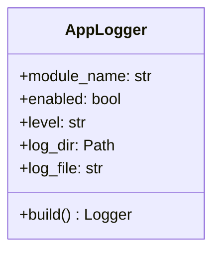
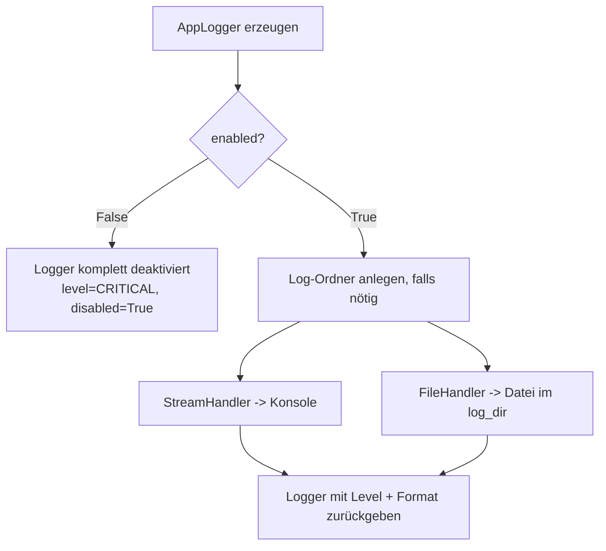
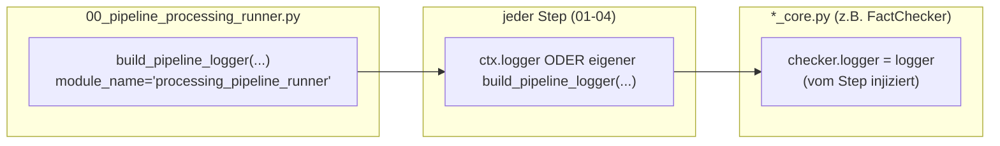

# Logger-Integration

## Zentrale Logger-Fabrik: `AppLogger`

Alle Module nutzen dieselbe kleine Hilfsklasse aus
[`common/app_logger.py`](../../src/02_processing/common/app_logger.py), damit Logging überall
gleich aussieht und sich gleich verhält.



### Was macht `AppLogger.build()`?



- Konsole und Datei gleichzeitig, wenn aktiviert.
- Format: `%(asctime)s | %(levelname)s | %(name)s | %(message)s`
- Wiederholtes Aufrufen von `build()` entfernt vorherige Handler zuerst, so entstehen keine
  doppelten Log-Zeilen, wenn derselbe Logger mehrfach konfiguriert wird.
- Ist `enabled=False`, wird der Logger nicht nur leise gemacht, sondern deaktiviert
  (`logger.disabled = True`), es entsteht praktisch kein Overhead.

## Wo wird der Logger erzeugt?



1. **Runner-Ebene**: Der Runner erzeugt einen Logger (`processing_pipeline_runner`) und legt ihn
   im `LoadContext` (`ctx.logger`) ab.
2. **Step-Ebene**: Wird ein Step über den Runner aufgerufen, nutzt er `ctx.logger` weiter. Wird er
   eigenständig aufgerufen (`python 01_pipeline_text_summarizer.py ...`), baut er sich seinen
   eigenen Logger über `build_pipeline_logger(...)` bzw. direkt `AppLogger(...).build()`.
3. **Modul-Ebene**: Der Step reicht den Logger an die fachliche Klasse weiter
   (z. B. `checker.logger = logger`), damit auch die Kern-Logik (LLM-Aufrufe, Web-Suche, ...)
   mitloggen kann.

Dadurch landen alle Log-Zeilen eines Laufs, egal ob Runner, Step oder Modul-Logik, im
selben Format und (sofern kein eigener `log_file` gesetzt ist) im selben Log-Verzeichnis.

## Konfiguration pro Modul/Step

Jeder Step und jedes Modul hat dieselben vier Logging-Parameter (CLI und/oder JSON-Config):

| Parameter | Bedeutung |
|---|---|
| `log_enabled` / `--log-enabled` | Logging an/aus |
| `log_level` / `--log-level` | `DEBUG`, `INFO`, `WARNING`, `ERROR`, `CRITICAL` |
| `log_dir` / `--log-dir` | Zielordner (Standard: `silver_enriched/logs/`) |
| `log_file` / `--log-file` | Dateiname, z. B. `fact_checker.log` |

### Log-Dateien im Projekt

```text
src/02_processing/silver_enriched/logs/
├── processing_pipeline.log       # Runner-Gesamtlauf
├── text_summarizer.log           # eigenständiger Modul-Lauf
├── fact_checker.log
├── transcript_embedder.log
└── emotion_analyser.log
```

Hinweis: Wird ein Step über den Runner ausgeführt, schreibt er standardmäßig in dieselbe Datei
wie der Runner (`processing_pipeline.log`), da er `ctx.logger` wiederverwendet. Nur bei
eigenständigem Aufruf eines Steps entsteht eine separate, modulspezifische Log-Datei.

## Was wird geloggt? (Beispiele aus `pipeline_utils.py`)

| Phase | Beispiel-Log-Zeile |
|---|---|
| Lauf-Start | `pipeline: start mode=delta dry_run=False steps=embedder batch_id=-` |
| DB-Fetch Start | `DB fetch start: step=fact_checker level=chapter mode=delta ids=all test_end_ts=None` |
| Delta-Watermark-Check | `delta watermark check: step=fact_checker level=chapter source=chapters.preprocessing_updated_at target=fact_checked_claims.processing_updated_at target_current_max=2026-05-10 08:00:00+00:00` |
| DB-Fetch Ende | `DB fetch done: step=fact_checker level=chapter rows=42` |
| Pro-Zeile Debug | `chunk=<id> step=fact_checker level=chapter reason=preprocessing_gt_processing preprocessing_updated_at=... processing_updated_at=... test_end_ts=None` |
| DB-Write | `DB write start: fact_checked_claims count=120 batch_id=<uuid>` |
| Fehlerfall | `pipeline: rollback failed` / `pipeline: failed` (inkl. Stacktrace via `logger.exception`) |

Diese feingranulare Protokollierung erlaubt es, pro Datensatz nachzuvollziehen, warum er
verarbeitet oder übersprungen wurde (`reason=...` im Debug-Log). Das hilft besonders beim
Debuggen der Delta-Logik.

## Fehlerbehandlung & Logging

- Bei einer Exception innerhalb eines Steps wird (sofern der Step seinen Batch selbst besitzt) die
  Transaktion zurückgerollt und der Batch als `failed` markiert, beides wird geloggt
  (`pipeline_batch: rollback failed` im schlimmsten Fall, falls sogar der Rollback fehlschlägt).
- Der Runner loggt zusätzlich `pipeline: failed` mit vollständigem Stacktrace (`logger.exception`)
  und wirft die Exception danach erneut. Der Prozess terminiert also sichtbar mit Fehlercode statt
  einen Fehler zu verschlucken.
