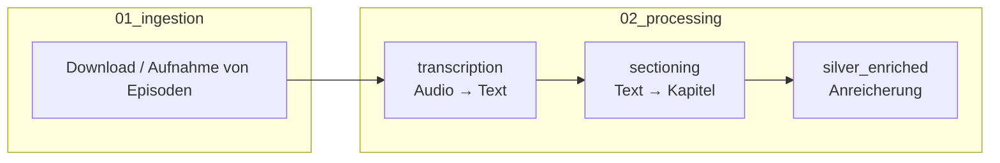
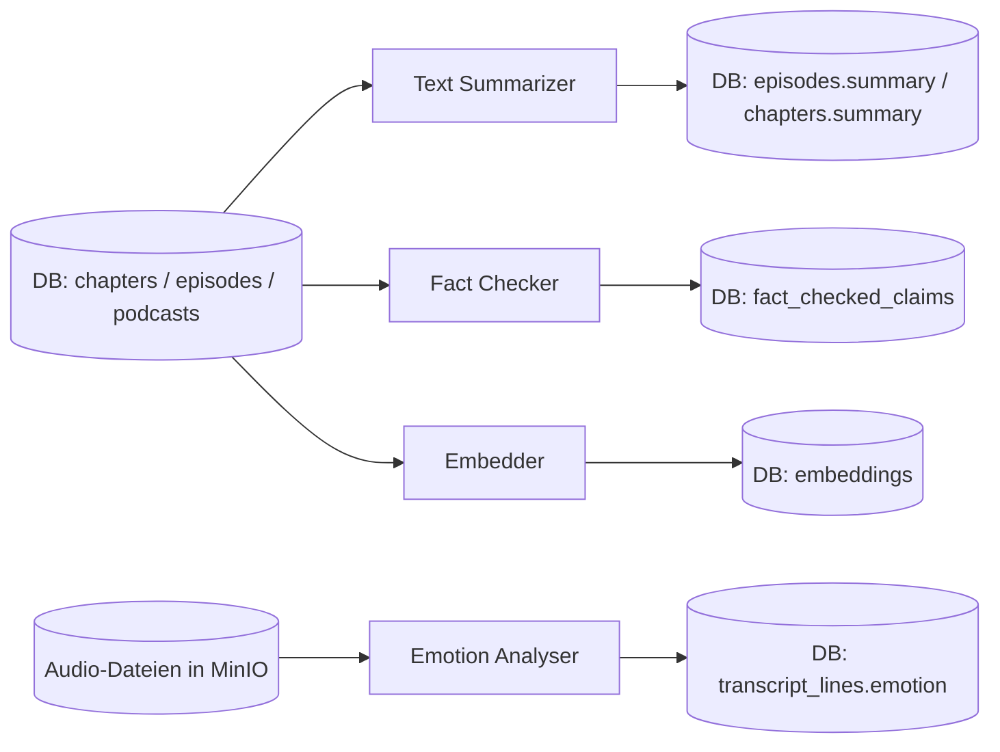

# Silver Enriched - Übersicht

> Diese Doku-Reihe beschreibt die Verarbeitungsschicht **Silver Enriched** im `media-lens`-Projekt.
> Sie liegt im Code unter [`src/02_processing/silver_enriched/`](../../src/02_processing/silver_enriched/).

## Was ist Silver Enriched?

Silver Enriched ist der Anreicherungs-Schritt der Datenpipeline. Er nimmt bereits transkribierte
und in Kapitel zerlegte Podcast-Daten ("Silver"-Rohdaten) und erzeugt daraus zusätzliche,
inhaltlich wertvolle Informationen ("Enriched"):

- Zusammenfassungen (Summaries) für Episoden und Kapitel
- Fakten-Checks (Claims, Web-Recherche, Bewertung)
- Embeddings (Vektor-Repräsentationen für semantische Suche)
- Emotionserkennung (aus dem Audio, pro Transkript-Zeile)

Jede dieser vier Aufgaben ist ein eigenständiges Modul. Sie lassen sich sowohl alleine als auch über
einen zentralen Runner steuern.

## Wo befinden wir uns in der Gesamt-Pipeline?

- **transcription** und **sectioning** sind die Vorverarbeitung ("preprocessing"). Sie erzeugen die
  Rohdaten (Transkript-Zeilen, Kapitel) und setzen dabei jeweils `preprocessing_updated_at`.
- **silver_enriched** ist die Verarbeitung ("processing"). Es liest diese Rohdaten und schreibt
  Ergebnisse zurück in die Datenbank, versehen mit `processing_updated_at`.
- Dieses Zusammenspiel aus zwei Zeitstempeln ist die Grundlage für den Delta-Load
  (siehe [02_load_strategy.md](02_load_strategy.md)).

## Inhalt dieser Doku-Reihe

| Datei                                      | Inhalt                                                  |
| ------------------------------------------ | ------------------------------------------------------- |
| [01_architecture.md](01_architecture.md)   | Projektstruktur, Ordner, Orchestrierung über den Runner |
| [02_load_strategy.md](02_load_strategy.md) | Full- vs. Delta-Load, Glossar (Watermark & Co.)         |
| [03_parameters.md](03_parameters.md)       | Alle Steuerungs-Parameter (CLI + Config-Dateien)        |
| [04_modules.md](04_modules.md)             | Die vier Module im Detail: Input, Output, Flow, Modelle |
| [05_logging.md](05_logging.md)             | Wie der Logger funktioniert und eingebunden ist         |

## Kurz-Glossar (Details siehe [02_load_strategy.md](02_load_strategy.md))

| Begriff    | Kurz-Erklärung                                                                    |
| ---------- | --------------------------------------------------------------------------------- |
| Full Load  | Alles wird neu verarbeitet, ohne Filter                                           |
| Delta Load | Nur neue/geänderte Datensätze werden verarbeitet                                  |
| Watermark  | Ein Zeitstempel, der als Marke dient, um zu erkennen, was schon verarbeitet wurde |
| Batch      | Ein einzelner Pipeline-Lauf, dokumentiert in `pipeline_batches`                   |

## High-Level-Architektur

---

> Hinweis: Diese Dokumentation wurde mit der Unterstützung von KI (Claude Sonnet 4.6) geschrieben.
