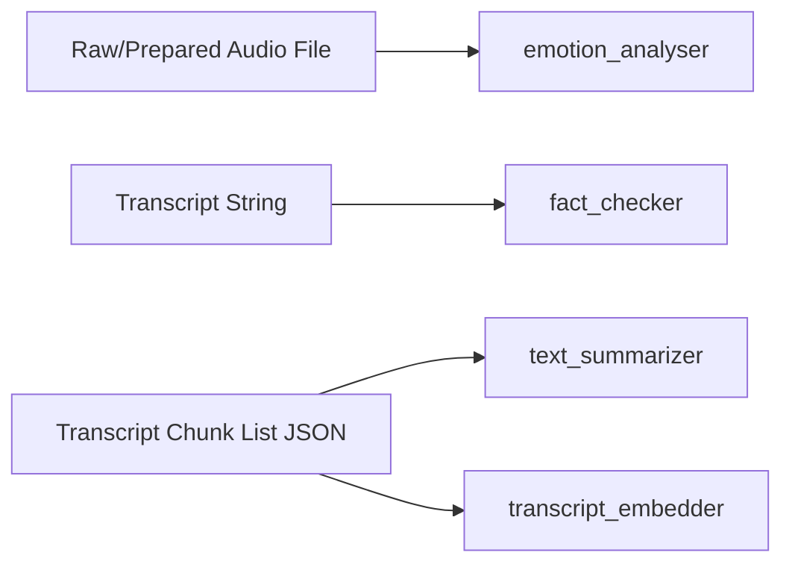
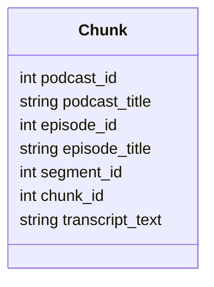
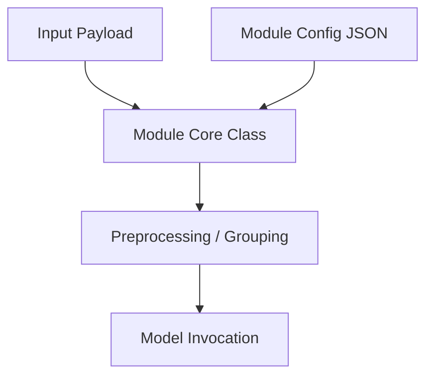

# Silver Enriched Input Data Structures

## Purpose

This document describes the input data structures used by the silver_enriched modules:

- emotion_analyser
- fact_checker
- text_summarizer
- transcript_embedder

It focuses on the shape of inputs expected at runtime, not implementation details.

## Input Contract Overview



## 1) emotion_analyser Inputs

The emotion module consumes one or more local audio files.

### Primary runtime input

- Type: file path string
- Accepted formats: .wav, .m4a
- Source:
  - CLI positional arguments, or
  - fallback list from config.test_files

### Minimal examples

Single file path input:

```text
"happy_example.wav"
```

Multiple file path inputs:

```json
["angry_example.wav", "sad_example.m4a", "happy_example.wav"]
```

### Resolution and preprocessing behavior

- Relative paths are resolved against config.audio_dir.
- .m4a is converted to .wav using ffmpeg before inference.
- Audio is loaded at config.sample_rate (default 16000).

### Config fields that affect input handling

- audio_dir: Base directory for relative audio paths.
- test_files: Default file list when CLI files are not provided.
- sample_rate: Target sample rate for loading audio.
- ffmpeg_binary, ffmpeg_audio_channels, ffmpeg_audio_rate: Conversion settings for .m4a.

## 2) fact_checker Inputs

The fact checker consumes a single transcript string.

### Primary runtime input

- Type: string
- Method: FactChecker.fact_check(transcript: str)

### Minimal example

```text
"Jupiter is the largest planet in our solar system..."
```

### Semantic expectations

The transcript can contain mixed content, but best results come from text that includes explicit factual claims.

### Internal derived structures from the input

The module transforms the transcript into:

- claims: List[string]
- research map: Dict[claim -> List[source objects]]

Source object shape (internal):

```json
{
  "url": "https://example.com/article",
  "title": "Article title",
  "snippet": "Short extracted evidence text"
}
```

### Config fields that affect input interpretation

- max_queries_per_claim
- max_search_results_per_query
- max_sources_per_claim
- allowed_verdicts
- region

These settings control how much evidence is collected per transcript-derived claim.

## 3) transcript_embedder Inputs

The transcript embedder consumes transcript chunks represented as objects, loaded from JSON (same envelope style as the summarizer).

### Primary runtime input

- Type: List[Chunk]
- Methods:
  - embed_chunks(chunks)
  - embed_podcasts(chunks)
  - embed_episodes(chunks)
  - embed_segments(chunks)

### Supported JSON envelope formats

Format A (top-level list):

```json
[
  {
    "podcast_id": "pod_lex",
    "episode_id": "ep_42",
    "segment_id": "seg_01",
    "chunk_id": "chunk_001",
    "transcription": "Transformers changed the field of NLP forever."
  }
]
```

Format B (object with chunks key):

```json
{
  "chunks": [
    {
      "podcast_id": "pod_lex",
      "episode_id": "ep_42",
      "segment_id": "seg_01",
      "chunk_id": "chunk_001",
      "transcription": "Transformers changed the field of NLP forever."
    }
  ]
}
```

Podcast-level minimal input example:

```json
[
  {
    "episode_id": "ep_42",
    "podcast_id": "pod_lex",
    "transcription": "Transformers changed the field of NLP forever."
  }
]
```

### Chunk schema expectations

Common identifier fields used for grouping/filtering:

- podcast_id
- episode_id
- segment_id
- chunk_id

Text source fields:

- Primary: config.input_text_field (default `transcription`)
- Fallbacks used by code: `transcript_text`, then `transcription`

Metadata fields that are preserved when present:

- podcast_title
- episode_title

### Ordering semantics

- Podcast-level embeddings aggregate text grouped by `podcast_id` across episodes.
- For podcast-level mode, at most `max_podcast_sample_size` podcasts are randomly sampled from all available podcast IDs.
- Episode-level embeddings are built from chunks sorted by (segment_id, chunk_id).
- Segment-level embeddings are built from chunks sorted by (segment_id, chunk_id).

### Output envelope shape

The executor writes output in this structure:

```json
{
  "embedded": {
    "chunk_level": [
      {
        "...original chunk fields": "...",
        "embedding": [0.01, -0.02, 0.03],
        "embedding_model": "qwen3-embedding:4b",
        "embedding_level": "chunk"
      }
    ],
    "podcast_level": [
      {
        "podcast_id": "pod_lex",
        "source_episode_count": 2,
        "source_episode_ids": ["ep_42", "ep_43"],
        "embedding": [0.01, -0.02, 0.03],
        "embedding_model": "qwen3-embedding:4b",
        "embedding_level": "podcast"
      }
    ],
    "episode_level": [
      {
        "podcast_id": "pod_lex",
        "episode_id": "ep_42",
        "source_chunk_count": 2,
        "embedding": [0.01, -0.02, 0.03],
        "embedding_model": "qwen3-embedding:4b",
        "embedding_level": "episode"
      }
    ],
    "segment_level": [
      {
        "podcast_id": "pod_lex",
        "episode_id": "ep_42",
        "segment_id": "seg_01",
        "source_chunk_count": 1,
        "embedding": [0.01, -0.02, 0.03],
        "embedding_model": "qwen3-embedding:4b",
        "embedding_level": "segment"
      }
    ]
  }
}
```

### Config fields that affect input interpretation

- input_text_field: Which key to read transcript text from.
- task_instruction: Prefix added before each text before embedding.
- batch_size: Number of texts per embedding batch request.
- max_podcast_sample_size: Maximum number of podcasts randomly selected for podcast-level embedding.
- default_mode: Which output levels to produce (`chunk`, `podcast`, `episode`, `segment`, `all`).
- embed_options: Extra parameters forwarded to `ollama.embed`.

## 4) text_summarizer Inputs

The summarizer consumes transcript chunks represented as objects, usually loaded from JSON.

### Primary runtime input

- Type: List[Chunk]
- Methods:
  - summarize_all_episodes(chunks)
  - summarize_all_segments(chunks)

### Supported JSON envelope formats

Format A (top-level list):

```json
[
  {
    "podcast_id": 1,
    "episode_id": 101,
    "segment_id": 1,
    "chunk_id": 1,
    "transcript_text": "..."
  }
]
```

Format B (object with chunks key):

```json
{
  "chunks": [
    {
      "podcast_id": 1,
      "episode_id": 101,
      "segment_id": 1,
      "chunk_id": 1,
      "transcript_text": "..."
    }
  ]
}
```

### Chunk schema



Required fields for reliable operation:

- podcast_id
- episode_id
- segment_id
- chunk_id
- transcript_text

Strongly recommended metadata fields:

- podcast_title
- episode_title

### Ordering semantics

- Episode summaries sort by (segment_id, chunk_id).
- Segment summaries sort by chunk_id.

So input should provide stable numeric ids for deterministic transcript assembly.

## Unified Example for Summarizer Input

```json
{
  "chunks": [
    {
      "podcast_id": 1,
      "podcast_title": "Data Stories",
      "episode_id": 101,
      "episode_title": "What Is Data Engineering",
      "segment_id": 1,
      "chunk_id": 1,
      "transcript_text": "In this segment we define data engineering..."
    },
    {
      "podcast_id": 1,
      "podcast_title": "Data Stories",
      "episode_id": 101,
      "episode_title": "What Is Data Engineering",
      "segment_id": 1,
      "chunk_id": 2,
      "transcript_text": "The host emphasizes batch and streaming patterns..."
    }
  ]
}
```

## Input Validation Guidance

Recommended checks before calling silver_enriched modules:

- emotion_analyser:
  - file exists
  - extension is .wav or .m4a
- fact_checker:
  - transcript is non-empty text
- text_summarizer:
  - chunks is a non-empty list
  - required keys exist in every chunk
  - ids are consistent and sortable
- transcript_embedder:
  - chunks is a non-empty list
  - selected text field exists (or fallback text fields are present)
  - ids are consistent for grouping/filtering across chunk/episode/segment modes
  - podcast mode processes only a random subset of podcasts up to `max_podcast_sample_size`

## How Config and Inputs Interact



Input provides the content to process; config provides the runtime policy:

- which model to use
- how much context/evidence to process
- where to read/write operational artifacts (for example logs)
